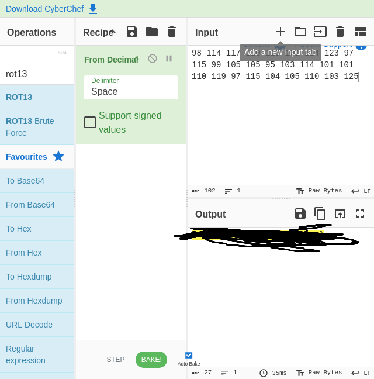

# Going Paperless

## Writeup

The description basically tells us the printer is converting the data to decimal. So with our encoded message we just need to convert the message `98 114 117 110 110 101 114 123 97 115 99 105 105 95 103 114 101 101 110 119 97 115 104 105 110 103 125` back to its ascii form.

In CyberChef we can use the `From Decimal` recipe to get the flag.

