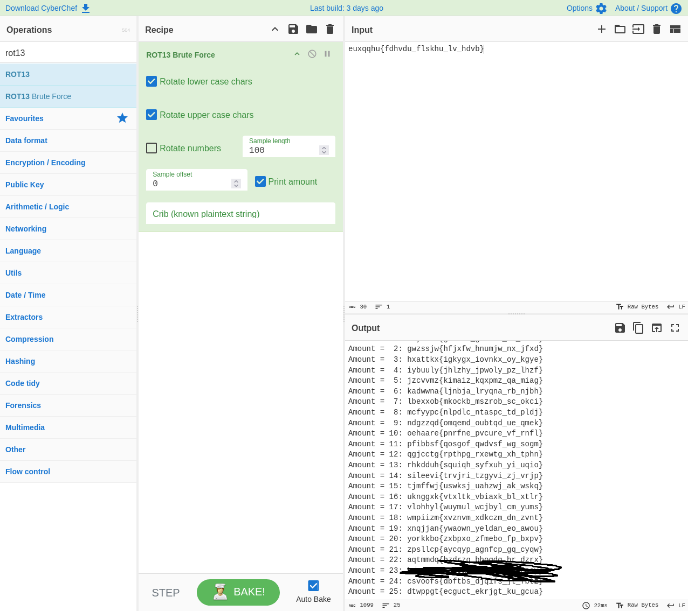

# Legacy Cipher

## Writeup

The description hints at caesar cipher being used to encrypt the message we receive `euxqqhu{fdhvdu_flskhu_lv_hdvb}`.

Using cyberchefs `ROT13 Brute Force` Recipe I was able to discover the flag and the key used to encrypt the message.

