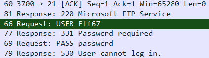
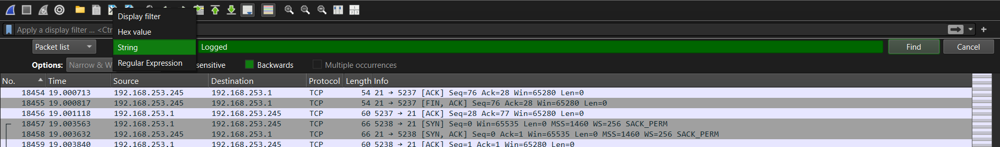
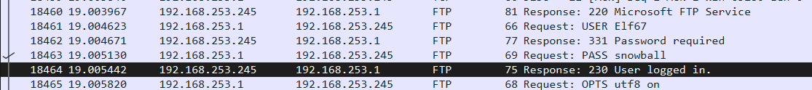

# The First Strike

**Challenge Link:** <https://cyberstudents.net/advent/2025/challenges?challenge=cmip8hw1c00wtk0eicwd6qrqj>

**Category:** Forensics

**Points:** 50

**Author:** a_person9852

## Writeup

For this challenge we have **2** targets:

1. Find which account was compromised
2. Find the password used to login to this account

After opening `ftpchal.pcap` I looked at the first couple packets and noticed that when a user login fails it says "user cannot log in" so I thought "maybe logged in comes up on success"

To search for this I hit **Ctrl+F** to bring up the search menu and switch it to String mode.

Then I looked up `logged` and I found the compromised account since it was the only one that had a successful login.

Now we can put the username and password into the flag format provided to beat the challenge!!!
