# Dream Job-1

## Description

You are a junior threat intelligence analyst at a Cybersecurity firm. You have been tasked with investigating a Cyber espionage campaign known as Operation Dream Job. The goal is to gather crucial information about this operation.

## Approach

### Who conducted Operation Dream Job?

First I searched up the campaign on Google and the first thing that came up was a [Mitre Att&ck page](https://attack.mitre.org/campaigns/C0022/)

The very first line in the alleges it was conducted by `Lazarus Group`

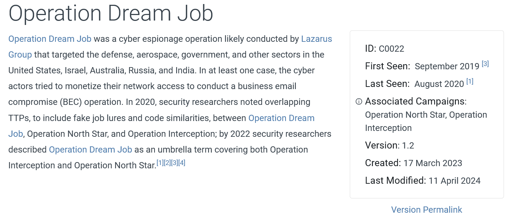

### When was this operation first observed?

We can see on the side of the page it says `First Seen: September 2019` which is when it was first observed.

### There are 2 campaigns associated with Operation Dream Job. One is Operation North Star, what is the other?

On the same part of the page we can see `Associated Campaigns` which features the above and `Operation Interception`

### During Operation Dream Job, there were the two system binaries used for proxy execution. One was Regsvr32, what was the other?

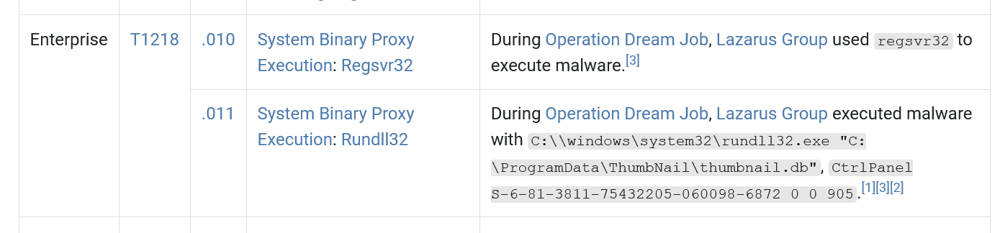

The other technique in this set is `T1218.011` where the system binary `Rundll32` is used.

### What lateral movement technique did the adversary use?

I noticed while I was checking out the techniques that they used `Internal Spearphishing` to get access to other computers.

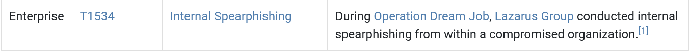

### What is the technique ID for the previous answer?

This one is just `T1534`

### What Remote Access Trojan did the Lazarus Group use in Operation Dream Job?

In the software section for the campaign we can see they used their own RAT `DRATzarus` to on compromised systems.

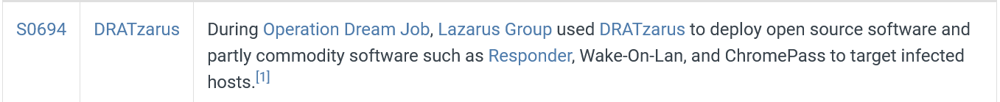

### What technique did the malware use for execution?

They used `Native API` calls to execute itself

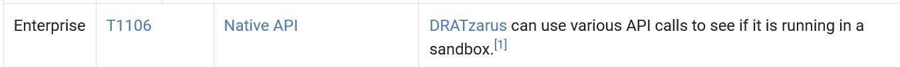

### What technique did the malware use to avoid detection in a sandbox?

At the end of the techniques it has a entry which has `Sandbox Evasion` in the name and the technique was called `Time Based Evasion`

### To answer the remaining questions, utilize VirusTotal and refer to the IOCs.txt file. What is the name associated with the first hash provided in the IOC file?

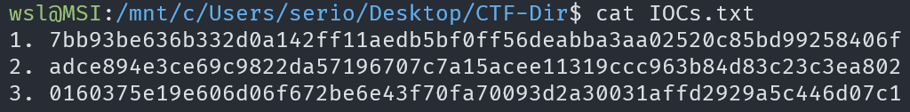

We are given some hashes to use in `VirusTotal` in the file `IOCs.txt`

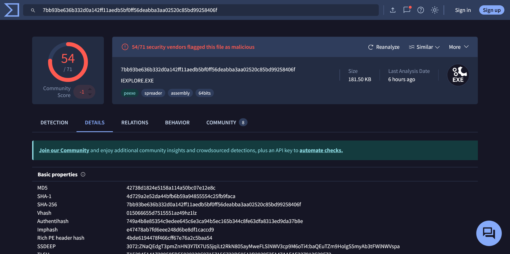

The name associated with the hash is `IEXPLORE.EXE`

### When was the file associated with the second hash in the IOC first created?

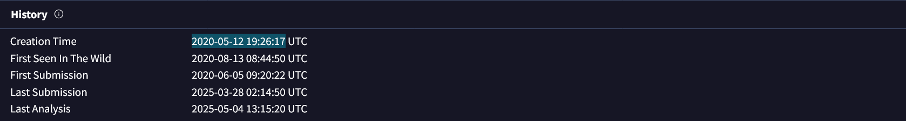

For the 2nd Hash the answer is under `History` where it says the `Creation Time`. This would be when the file was first created.

### What is the name of the parent execution file associated with the second hash in the IOC?

We can see under `Relations` that the parent executable is `BAE_HPC_SE.iso`

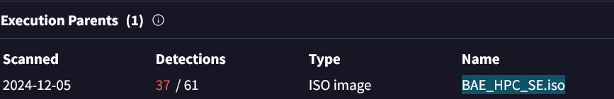

### Examine the third hash provided. What is the file name likely used in the campaign that aligns with the adversary's known tactics?

The name that seems the most likely is `Salary_Lockheed_Martin_job_opportunities_confidential.doc` since we know `Lazerus Group` used alot of `Phishing` in their campaign.

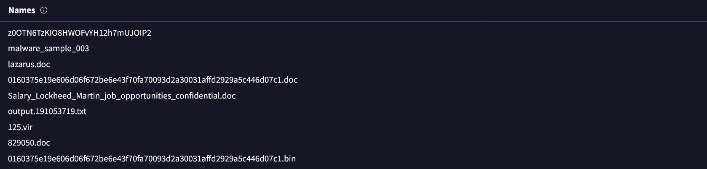

### Which URL was contacted on 2022-08-03 by the file associated with the third hash in the IOC file?

Under `Relations` we can see the URLs that are connected to by the malware.

For the given date `https://markettrendingcenter.com/lk_job_oppor.docx` was accessed was the third hash.

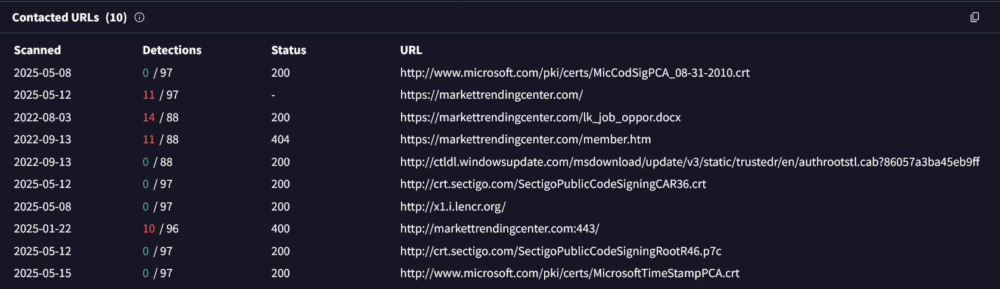
