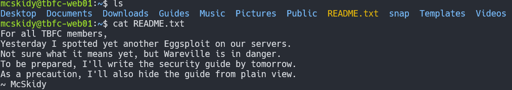
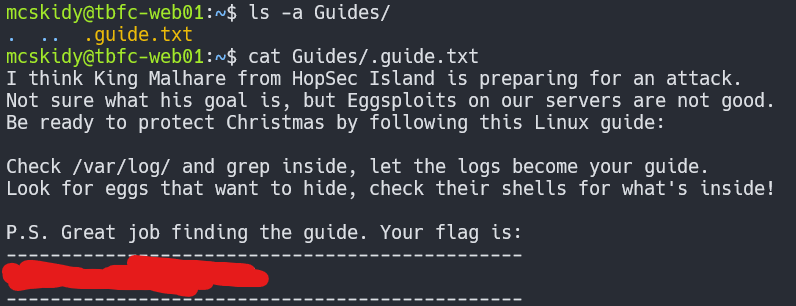
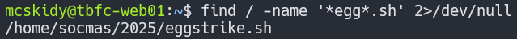
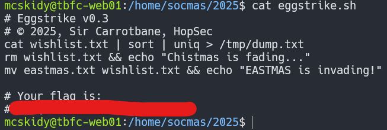
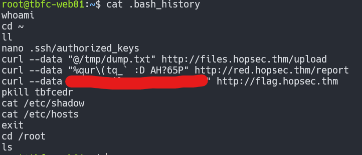
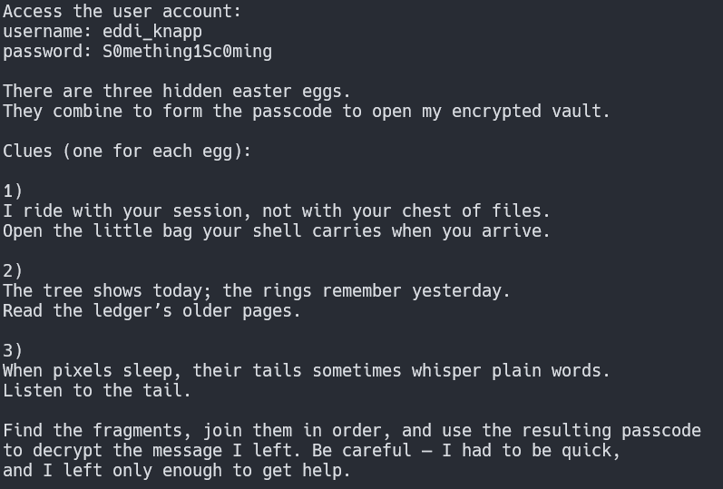

# Linux CLI - Shells Bells

**Room Link:** <https://tryhackme.com/room/linuxcli-aoc2025-o1fpqkvxti>

## Writeup

Before I start answering questions I'm going to connect to the VM using `ssh` on my local machine. This can be done using the command `ssh mcskidy@<ip>` with the credentials we are given.

1. Which CLI command would you use to list a directory?

This is the classic command `ls`

2. Identify the flag inside of the McSkidy's guide

Starting off we can run `ls` to view whats in this directory. 2 things stand out here, we see the `Guides` folder and `README.txt` file which are unusual.

Inside the `README.txt` we get a clue that the Guide we are looking for is "hidden from view".

From this information I'm going to run `ls -a` inside the `Guides` folder to see if the guide is in there. The `-a` flag just shows hidden files.

Lucky the file is there and we can read it to get the flag!

3. Which command helped you filter the logs for failed logins?

My first thought was `grep` which ended up being the answer.

4. Identify the flag inside the Eggstrike script

First things first is I need to find this script. I'm sure `egg` isn't common in file names so I'm just going to run `find / -name '*egg*.sh' 2>/dev/null`. 2 things to note about the command is we use single quotes because the shell we try to **expand** the `*` symbol if we don't. The other thing is `2>/dev/null`, this part will redirect the error messages we get to /dev/null which is basically a file that acts like a black hole. If we don't do this everytime we don't have permission to access a file it will show it.

Now we just need to read the file to get the flag.

5. Which command would you run to switch to the root user?

To switch to `root` we can just use the command `sudo su` with no arguments

6. Finally, what flag did Sir Carrotbane leave in the root bash history?

We can actually use `sudo su` so we can switch to `root`

Then we can switch to `/root` and read the file `.bash_history` to see what the Sir left and it's the flag!

7. For those who consider themself intermediate and want another challenge, check McSkidy's hidden note in /home/mcskidy/Documents/ to get access to the key for Side Quest 1!

For this challenge I started by moving to `/home/mcskidy/Documents/` and running `ls -a` and found only 1 file `read-me-please.txt`

Inside the file we are given 3 clues and credentials for a user account.

We need to find 3 easter eggs and combine them to decrypt a file inside this user's Documents folder.

Next I switched to the user and now we can get to the first clue.