# GamingServer

## Description

> Can you gain access to this gaming server built by amateurs with no experience of web development and take advantage of the deployment system.

## Writeup

### Port Scan

Starting off I ran a **rustscan** port scan over the whole port range using the command `rustscan -a $IP -r 1-65535 --ulimit 5000 -g`. From this I got `10.10.15.141 -> [22,80]`.

Now I can put those numbers through **nmap** to do a more targetted scan.

```text
PORT   STATE SERVICE VERSION
22/tcp open  ssh     OpenSSH 7.6p1 Ubuntu 4ubuntu0.3 (Ubuntu Linux; protocol 2.0)
| ssh-hostkey: 
|   2048 340efe0612673ea4ebab7ac4816dfea9 (RSA)
|   256 49611ef4526e7b2998db302d16edf48b (ECDSA)
|_  256 b860c45bb7b2d023a0c756595c631ec4 (ED25519)
80/tcp open  http    Apache httpd 2.4.29 ((Ubuntu))
| http-methods: 
|_  Supported Methods: POST OPTIONS HEAD GET
|_http-title: House of danak
|_http-server-header: Apache/2.4.29 (Ubuntu)
Service Info: OS: Linux; CPE: cpe:/o:linux:linux_kernel
```

Pretty basic results with no good vulnerabilities so I'm going to check out the webserver.

### HTTP

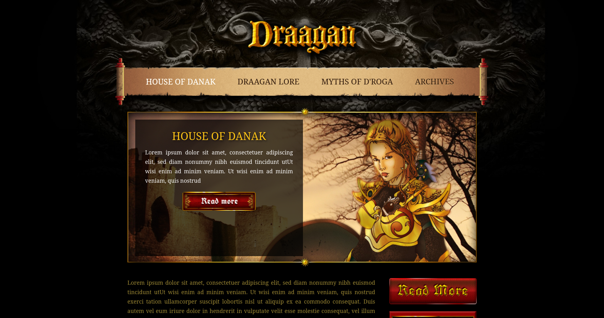

The site had a pretty cool look with a couple pages linked on the homepage. Of these pages one stoodout `http://10.10.15.141/about.html`.

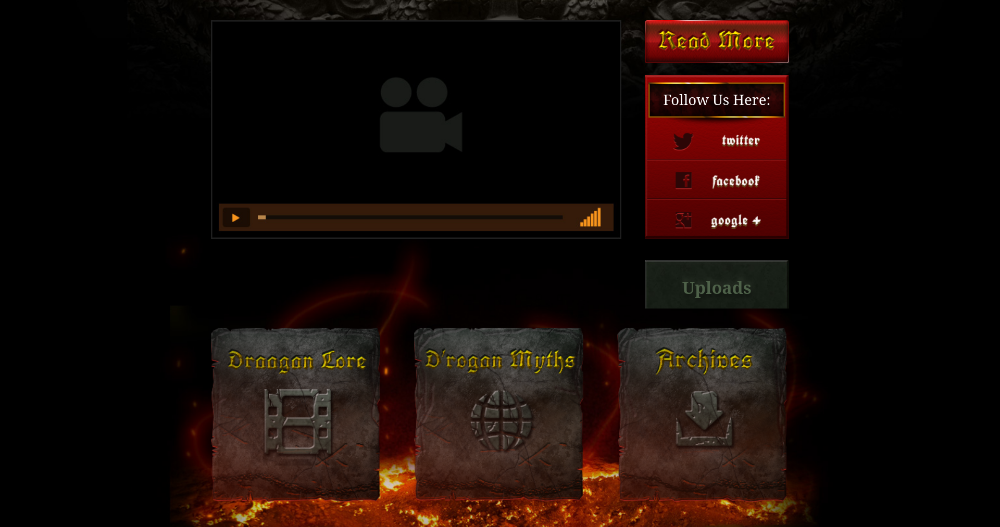.

You might notice the giant green **Uploads** button. Clicking this shows us the `/uploads/` directory list which had some interesting files

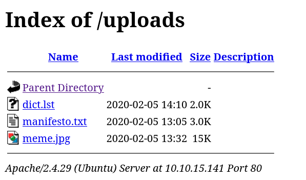

The one that stands out is `dict.lst` which is a password list which we can use to bruteforce a login. I noticed I didn't have a username so I looked back through the site and found the following comment.

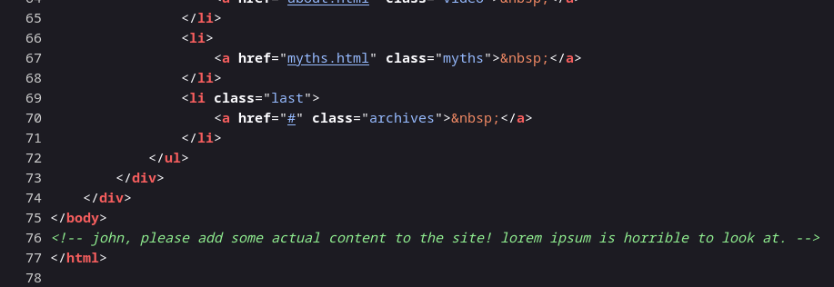

### SSH Attempt 1

Using the username `john`, I'm going to bruteforce the ssh password using **hydra** and `dict.lst`.

**Command**: `hydra -l john -P dict.lst ssh://$IP`

### HTTP Again

This actually didn't give me any success so I went back to http and moved onto some content discovery. First off I ran a directory scan using **feroxbuster**.

**Command**: `feroxbuster --url http://$IP/ --wordlist=/usr/share/SecLists/Discovery/Web-Content/directory-list-2.3-big.txt -t 200`

From this I found an RSA Private key at `http://10.10.15.141/secret/secretKey`.

### Initial Access (SSH)

Of course I tried to login into `john` using SSH with that key but it has a passphrase (Note: don't forget to `chmod 600 secretKey`).

Now I'm going to use **JohnTheRipper** to hopefully get the passphrase. First off I need to convert the private key to a john format using `ssh2john.py secretKey > hash.txt`. Next I just ran `john hash.txt` which gave me the passphrase.

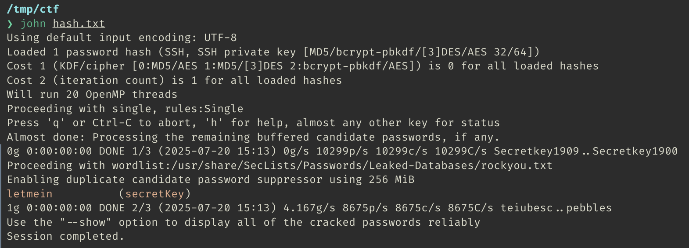

**BOOM!!!** Now we have initial access to the account `john` using ssh.

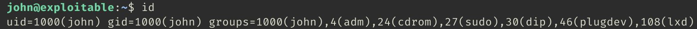

`user.txt` can be found in `john`'s home directory.

### Privilage Escalalation: root

I tried going through some typically things like SUID files or sudo permissions but didn't find anything so I went to `/tmp/` and download **LinEnum.sh** from my machine. One line stood out at the end.

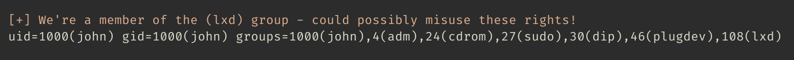

I really don't know what this means or what lxd is so I need to do some research...

OK so after some research I found out **lxd** is a container and virtual machine manager. Basically there is a common privilage escalation vector where you can create container with root privilages and mount the host filesystem on it. Then you can use the command `lxc exec` to run a command inside the container (i.e. open a shell) which will have root perms inside the container.

Since we don't have access to the internet we need to upload an image to the box from out own machine. In my research I saw people use <https://github.com/saghul/lxd-alpine-builder> because it's very small. It also has instruction for how to import the image into the lxd environment.

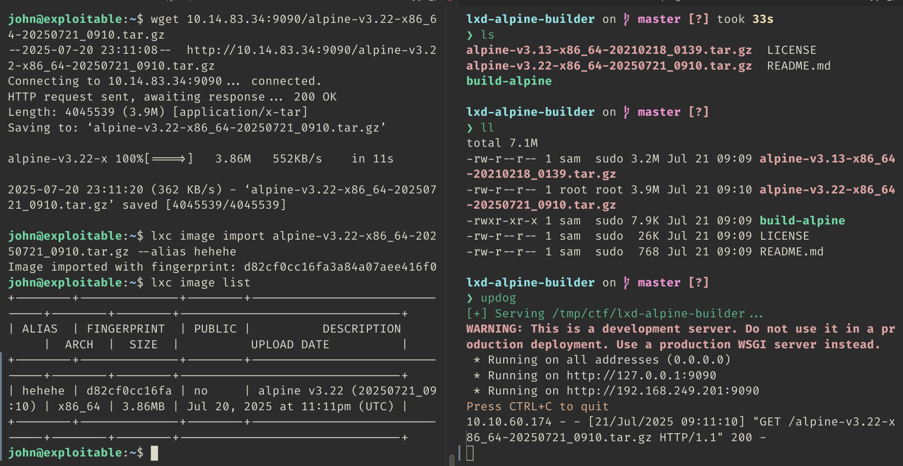

Might be a bit hard to read but basically I cloned the repo, ran `sudo ./build-alpine` then downloaded the built image into the victim host. After, I imported the image. Now that I have my image `hehehe` I can start and configure the container.

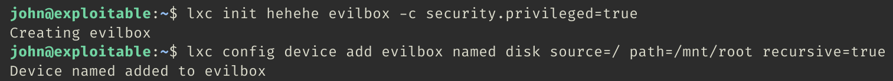

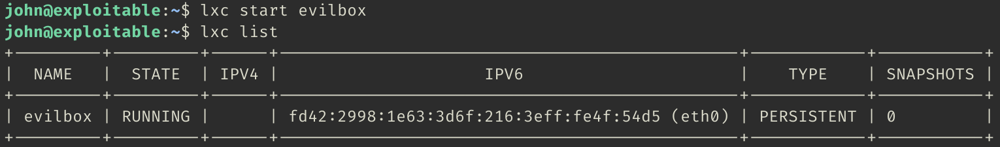

Now I can open a shell in the container which should have root permissions to be able to get the flag

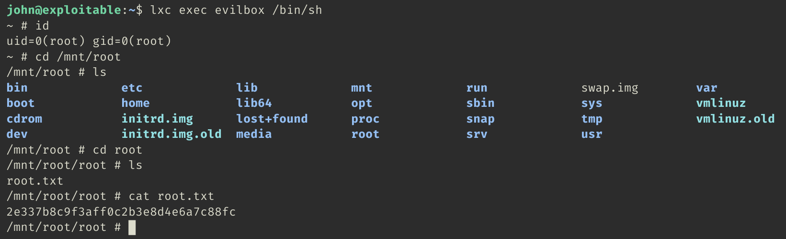
