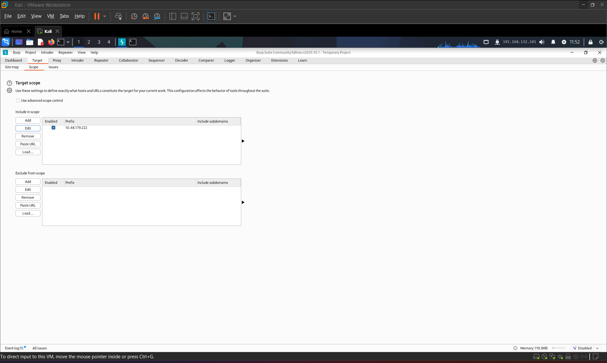
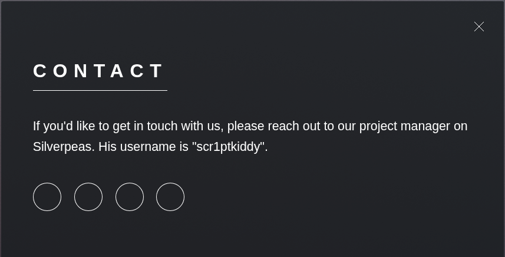

# Silver Platter

**Room Link:** <https://tryhackme.com/room/silverplatter>

## Description

Think you've got what it takes to outsmart the Hack Smarter Security team? They claim to be unbeatable, and now it's your chance to prove them wrong. Dive into their web server, find the hidden flags, and show the world your elite hacking skills. Good luck, and may the best hacker win!

But beware, this won't be a walk in the digital park. Hack Smarter Security has fortified the server against common attacks and their password policy requires passwords that have not been breached (they check it against the rockyou.txt wordlist - that's how 'cool' they are). The hacking gauntlet has been thrown, and it's time to elevate your game. Remember, only the most ingenious will rise to the top.

May your code be swift, your exploits flawless, and victory yours!

## Writeup

### Port Scan

Starting off I'm going to run a port scan over the full port range using the following Nmap command: `sudo nmap -p- -sV -T4 -vv -oA nmap-scan $TARGET_IP`

```text
Nmap scan report for 10.48.179.222
Host is up, received echo-reply ttl 62 (0.17s latency).
Scanned at 2025-11-16 11:24:41 AEDT for 810s
Not shown: 65532 closed tcp ports (reset)
PORT     STATE SERVICE    REASON         VERSION
22/tcp   open  ssh        syn-ack ttl 62 OpenSSH 8.9p1 Ubuntu 3ubuntu0.4 (Ubuntu Linux; protocol 2.0)
80/tcp   open  http       syn-ack ttl 62 nginx 1.18.0 (Ubuntu)
8080/tcp open  http-proxy syn-ack ttl 61
1 service unrecognized despite returning data. If you know the service/version, please submit the following fingerprint at https://nmap.org/cgi-bin/submit.cgi?new-service :
SF-Port8080-TCP:V=7.95%I=7%D=11/16%Time=69191CA0%P=x86_64-pc-linux-gnu%r(G
SF:etRequest,C9,"HTTP/1\.1\x20404\x20Not\x20Found\r\nConnection:\x20close\
SF:r\nContent-Length:\x2074\r\nContent-Type:\x20text/html\r\nDate:\x20Sun,
SF:\x2016\x20Nov\x202025\x2000:36:48\x20GMT\r\n\r\n<html><head><title>Erro
SF:r</title></head><body>404\x20-\x20Not\x20Found</body></html>")%r(HTTPOp
SF:tions,C9,"HTTP/1\.1\x20404\x20Not\x20Found\r\nConnection:\x20close\r\nC
SF:ontent-Length:\x2074\r\nContent-Type:\x20text/html\r\nDate:\x20Sun,\x20
SF:16\x20Nov\x202025\x2000:36:49\x20GMT\r\n\r\n<html><head><title>Error</t
SF:itle></head><body>404\x20-\x20Not\x20Found</body></html>")%r(RTSPReques
SF:t,42,"HTTP/1\.1\x20400\x20Bad\x20Request\r\nContent-Length:\x200\r\nCon
SF:nection:\x20close\r\n\r\n")%r(FourOhFourRequest,C9,"HTTP/1\.1\x20404\x2
SF:0Not\x20Found\r\nConnection:\x20close\r\nContent-Length:\x2074\r\nConte
SF:nt-Type:\x20text/html\r\nDate:\x20Sun,\x2016\x20Nov\x202025\x2000:36:50
SF:\x20GMT\r\n\r\n<html><head><title>Error</title></head><body>404\x20-\x2
SF:0Not\x20Found</body></html>")%r(Socks5,42,"HTTP/1\.1\x20400\x20Bad\x20R
SF:equest\r\nContent-Length:\x200\r\nConnection:\x20close\r\n\r\n")%r(Gene
SF:ricLines,42,"HTTP/1\.1\x20400\x20Bad\x20Request\r\nContent-Length:\x200
SF:\r\nConnection:\x20close\r\n\r\n")%r(Help,42,"HTTP/1\.1\x20400\x20Bad\x
SF:20Request\r\nContent-Length:\x200\r\nConnection:\x20close\r\n\r\n")%r(S
SF:SLSessionReq,42,"HTTP/1\.1\x20400\x20Bad\x20Request\r\nContent-Length:\
SF:x200\r\nConnection:\x20close\r\n\r\n")%r(TerminalServerCookie,42,"HTTP/
SF:1\.1\x20400\x20Bad\x20Request\r\nContent-Length:\x200\r\nConnection:\x2
SF:0close\r\n\r\n")%r(TLSSessionReq,42,"HTTP/1\.1\x20400\x20Bad\x20Request
SF:\r\nContent-Length:\x200\r\nConnection:\x20close\r\n\r\n")%r(Kerberos,4
SF:2,"HTTP/1\.1\x20400\x20Bad\x20Request\r\nContent-Length:\x200\r\nConnec
SF:tion:\x20close\r\n\r\n")%r(SMBProgNeg,42,"HTTP/1\.1\x20400\x20Bad\x20Re
SF:quest\r\nContent-Length:\x200\r\nConnection:\x20close\r\n\r\n")%r(LPDSt
SF:ring,42,"HTTP/1\.1\x20400\x20Bad\x20Request\r\nContent-Length:\x200\r\n
SF:Connection:\x20close\r\n\r\n")%r(LDAPSearchReq,42,"HTTP/1\.1\x20400\x20
SF:Bad\x20Request\r\nContent-Length:\x200\r\nConnection:\x20close\r\n\r\n"
SF:);
Service Info: OS: Linux; CPE: cpe:/o:linux:linux_kernel
```

From these results I'm guessing 8080 is a proxy for the nginx server on 80 but well see and the next step is probably enumerating the HTTP server.

### Port 80: HTTP

For this section I'm going to open Burp Suite and add the target ip to the scope



Next I'm going to open the burp browser and starting walking the website on port 80. This website is the webpage for the Hack Smarter Security team. Just walking the site I only found 2 potentially useful pieces of info. The 1st is the username `scr1ptkiddy`



The second is that the page is using the HTML5Up Dimensions template.


While I was doing that I also ran a directory scan using the tool gobuster and the following command: `gobuster dir -u $TARGET_IP/ -w /usr/share/wordlists/dirbuster/directory-list-2.3-medium.txt -t 100 -o gobuster-scan`

Unfortunately I didn't get anything that I could access.

```text
===============================================================
Gobuster v3.8
by OJ Reeves (@TheColonial) & Christian Mehlmauer (@firefart)
===============================================================
[+] Url:                     http://10.48.179.222/
[+] Method:                  GET
[+] Threads:                 100
[+] Wordlist:                /usr/share/wordlists/dirbuster/directory-list-2.3-medium.txt
[+] Negative Status codes:   404
[+] User Agent:              gobuster/3.8
[+] Timeout:                 10s
===============================================================
Starting gobuster in directory enumeration mode
===============================================================
/images               (Status: 301) [Size: 178] [--> http://10.48.179.222/images/]
/assets               (Status: 301) [Size: 178] [--> http://10.48.179.222/assets/]
Progress: 220558 / 220558 (100.00%)
===============================================================
Finished
===============================================================
```

For now I'm going to leave port 80 and move into port 8080 since I can't find anything obvious

### Port 8080: HTTP

Going to the page shows a 404 error as we saw from the nmap scan so I'm running another gobuster scan on this port using the following command: `gobuster dir -u http://$TARGET_IP:8080/ -w /usr/share/wordlists/dirbuster/directory-list-2.3-medium.txt -t 100 -o gobuster-scan-8080` which actually gave us some interesting results.

```text
===============================================================
Gobuster v3.8
by OJ Reeves (@TheColonial) & Christian Mehlmauer (@firefart)
===============================================================
[+] Url:                     http://10.48.179.222:8080/
[+] Method:                  GET
[+] Threads:                 100
[+] Wordlist:                /usr/share/wordlists/dirbuster/directory-list-2.3-medium.txt
[+] Negative Status codes:   404
[+] User Agent:              gobuster/3.8
[+] Timeout:                 10s
===============================================================
Starting gobuster in directory enumeration mode
===============================================================
/website              (Status: 302) [Size: 0] [--> http://10.48.179.222:8080/website/]
/console              (Status: 302) [Size: 0] [--> /noredirect.html]
Progress: 220558 / 220558 (100.00%)
===============================================================
Finished
===============================================================
```
