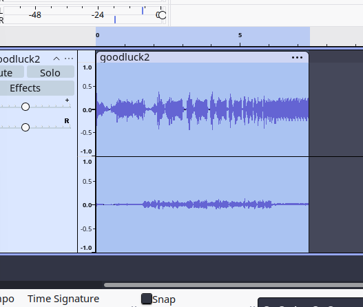
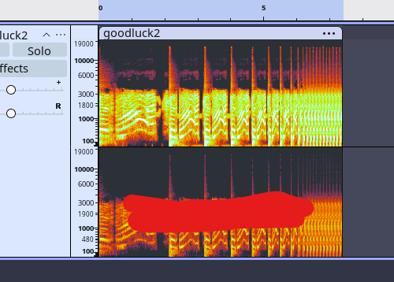

# good-luck!

## Room Info

- Points: 100
- Author: riyc
- Attachments: `goodluck2.mp3`

## Writeup

### Initial Analysis

After downloading `goodluck2.mp3` I ran a couple commands to get an overview of the file like:
- `file` -> It was an MP3 file
- `exiftool` -> Nothing stood out

### Finding hidden text

Due to those results I decided to open the file in `audacity` next which revealed a layer under the lady saying good luck.

and I decided to use the `Spectrogram View` of the track which revealed the text `[REDACTED]`.

### Flag Submission

Now putting the text in the flag format `gaslightCTF{[REDACTED]}` gives gives us the flag.

