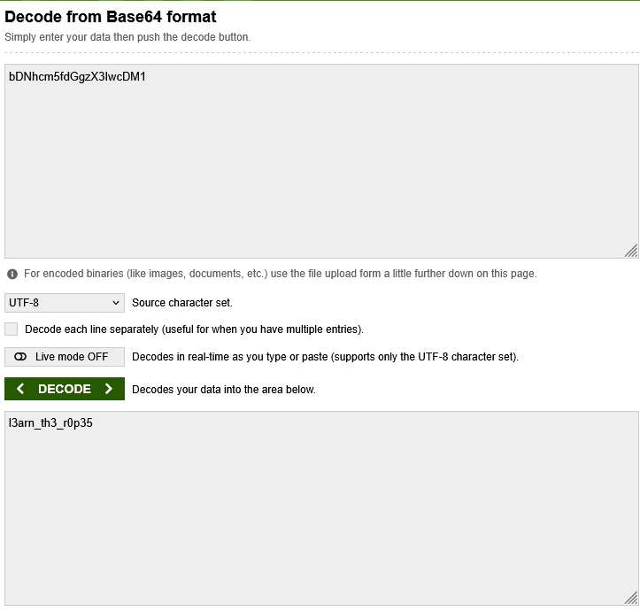

# Bases

## Description

What does this `bDNhcm5fdGgzX3IwcDM1` mean? I think it has something to do with bases.

## Approach

Given the title and description I went straight for base64. Using [this](https://www.base64decode.org/) online base64 decoder I got the flag.

