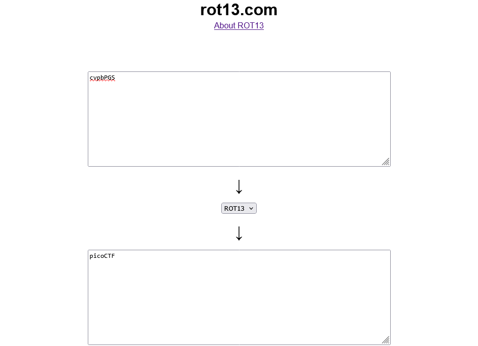
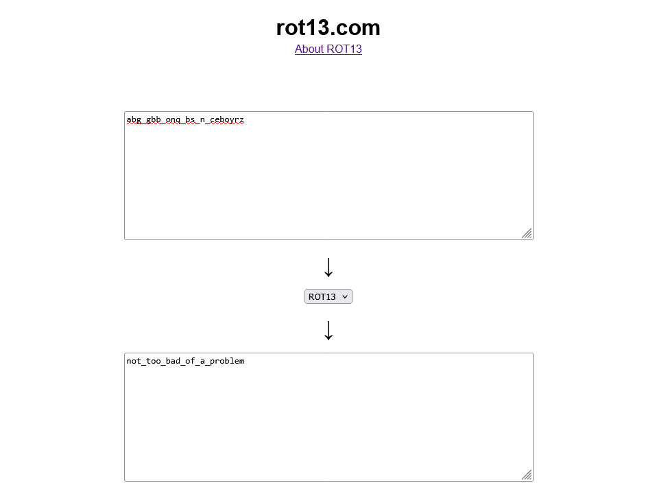

# 13

## Description

Cryptography can be easy, do you know what ROT13 is?

## Approach

We're given the following ciphertext `cvpbPGS{abg_gbb_onq_bs_n_ceboyrz}`.

ROT13 is a cipher that shifts each letter to the 13th letter after it (e.g. a -> n).

To decode it we can just shift each letter 13 places to the original letter. (e.g. n -> a)

I'm just going to use an [online decoder](https://rot13.com) and decode each part of the flag and combine them into the actual flag.

