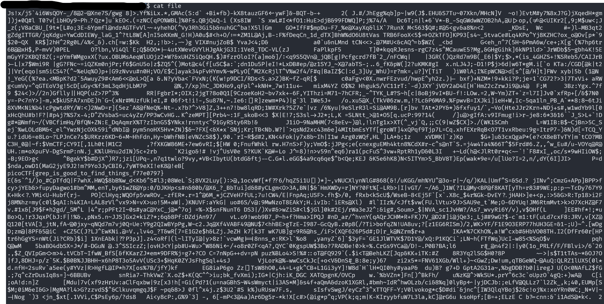
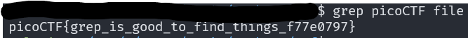

# First Grep

## Description

Can you find the flag in `file`? This would be really tedious to look through manually, something tells me there is a better way.

## Approach

Looking at the description and title, they are really hinting at using the tool `grep` which comes in most Linux distros. `grep` allows you to search for a specific string in a file.

After download the file called `file` we can see that it is a whole lot of nonsense.

We know the flag starts with `picoCTF` so we can use the command `grep picoCTF file` to look for strings that might be the flag. Using this command will return one entry which should be the flag.

