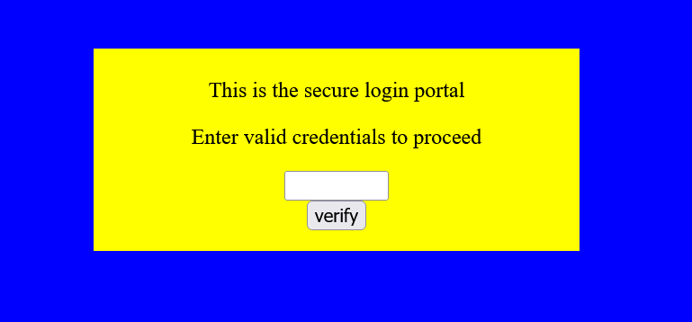
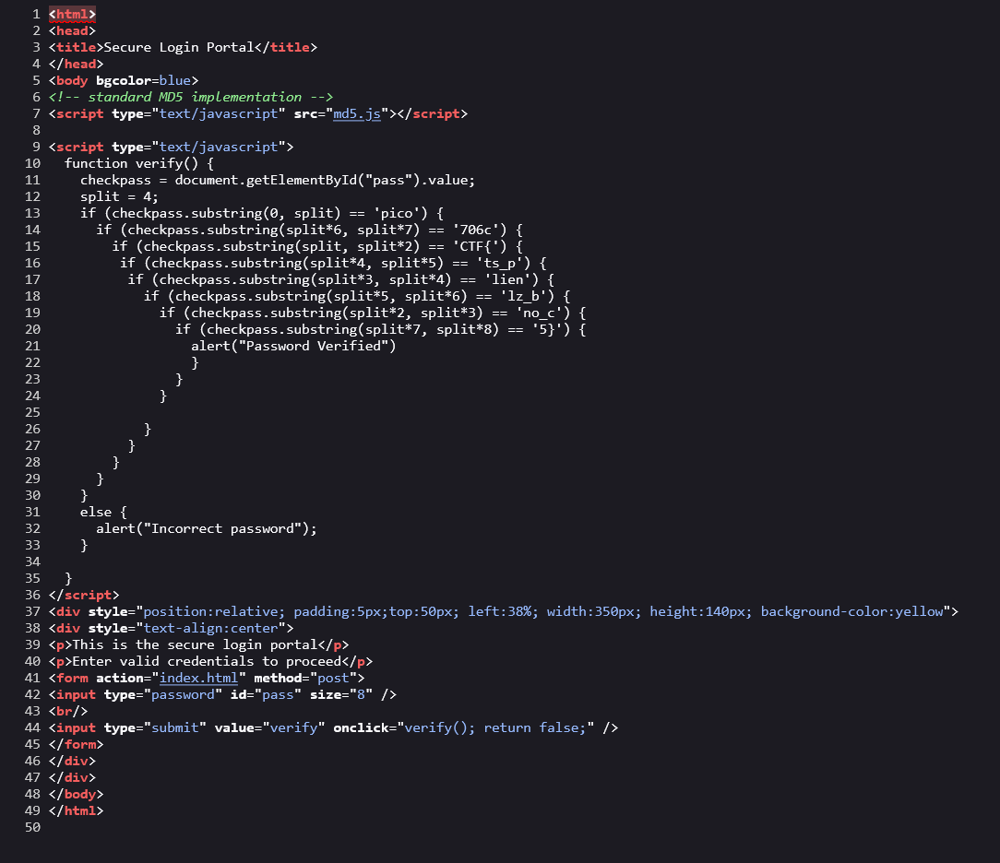
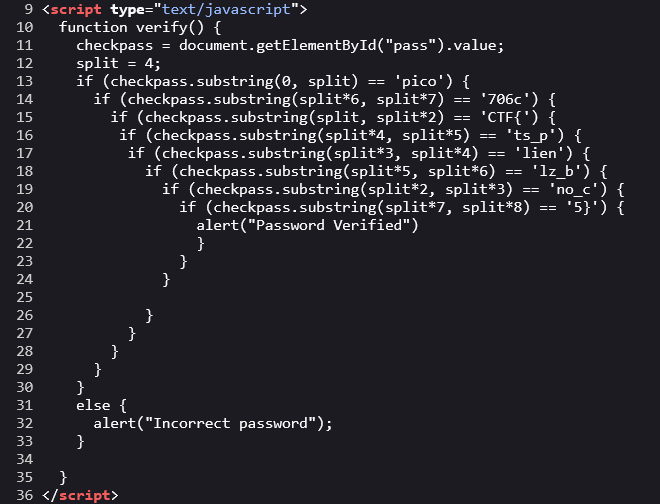
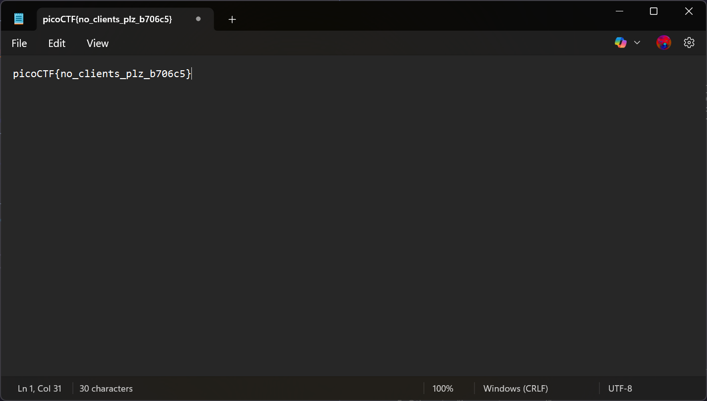

# dont-use-client-side

## Description

Can you break into this super secure portal?

## Approach

First I went to the target URL and saw a login page

Given the title, I decided to check for client side validation for this login page. First I opened the Page Source for the login page.

On the login page the text input is given the id `pass` and when we submit the password it calls the verify() function which is defined in the script tags.

The function basically follows this logic:

1. Get value of "pass"
2. Split value into section of four
3. Check sections: 1,7,2,5,4,6,3,8 in that order, against hardcoded strings
4. If all sections pass "Password Verified"
5. Otherwise "Incorrect password"

An approach to get the flag is to just reorder the hardcoded strings in the ascending order of the numbers above which should give the flag.

