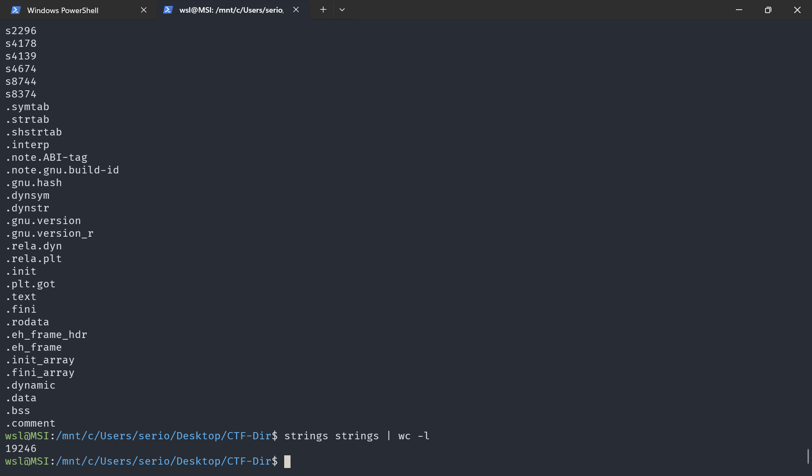
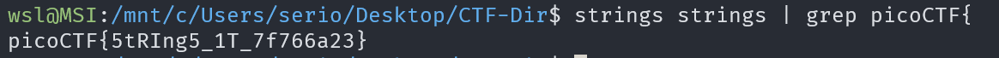

# strings it

## Description

Can you find the flag in file without running it?

## Approach

Before I even start I'm going to assume we need to use the program `strings` to extract the flag from the linked file.

When I downloaded the file `strings` I ran strings on it which returned 19246 lines

We know the flag starts with `picoCTF{` so I can just pipe the output of strings into grep with the command `strings strings | grep picoCTF{` which should return the flag.

