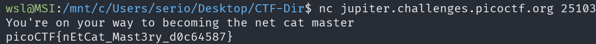

# what's a net cat?

## Description

Using netcat (nc) is going to be pretty important. Can you connect to `jupiter.challenges.picoctf.org` at `port 25103` to get the flag?

## Approach

For this challenge we can use the command `nc jupiter.challenges.picoctf.org 25103` to connect to the server and get the flag.

