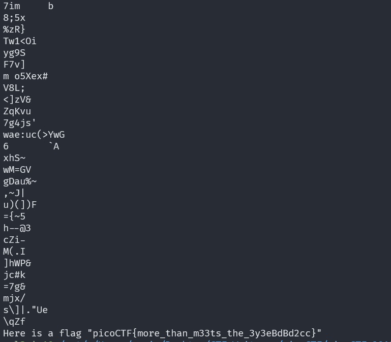

# Glory of the Garden

## Description

This garden contains more than it seems.

## Approach

We are given a jpeg of a garden.

I first tried to use `exiftool` to check the metadata of the image which didn't reveal anything interesting.

Next I tried to use `strings` to see if the flag is in the image which returned the flag.

