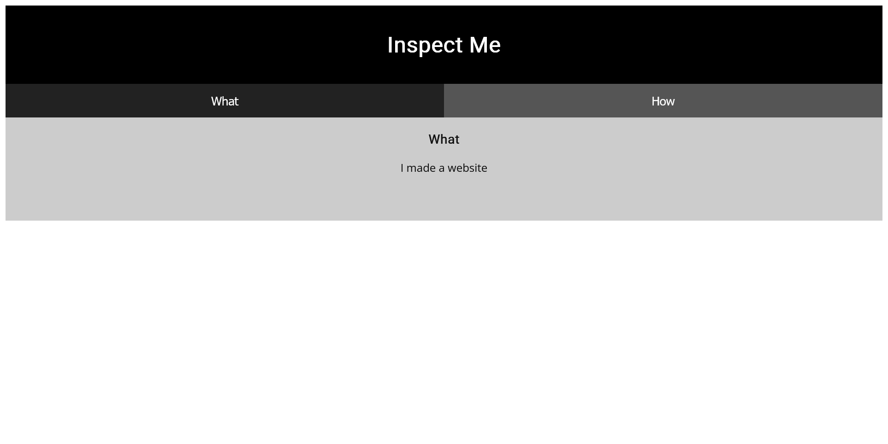
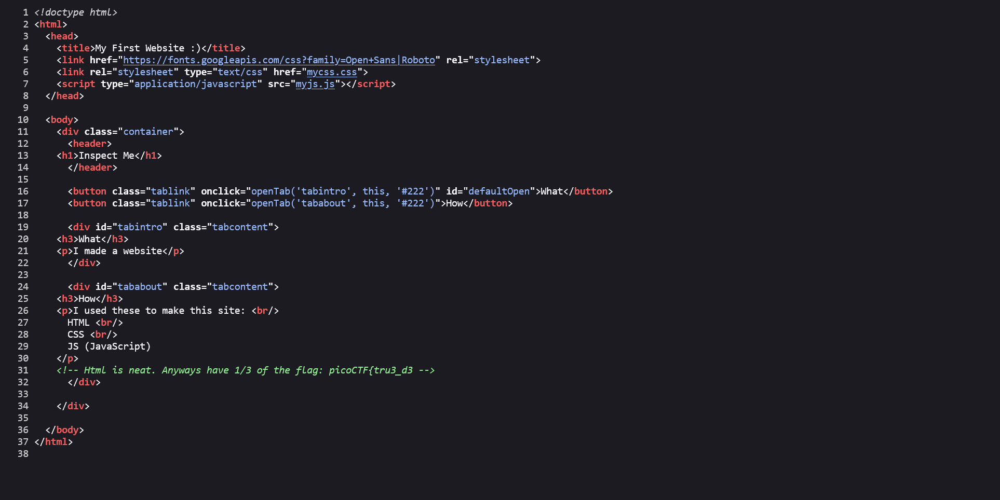
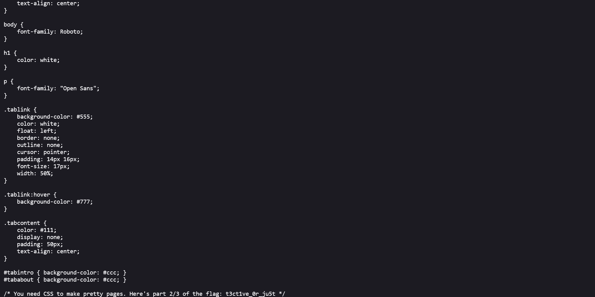
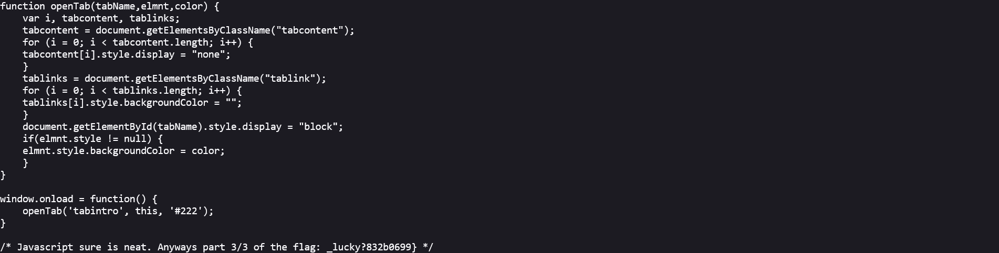

# Insp3ct0r

## Description

Kishor Balan tipped us off that the following code may need inspection

## Approach

Navigating to the URL showed us the following landing page:

Since the "code may need inspection" I decided to `View Page Source` which led me to the first part of the flag

In the \<head\> section of the HTML I saw `mycss.css` and `myjs.js` linked so I started with `mycss.css` which gave part 2 of the flag.

Then going to `myjs.js` gave the 3rd part as expected.

Now we can combine the 3 parts to get the flag!
