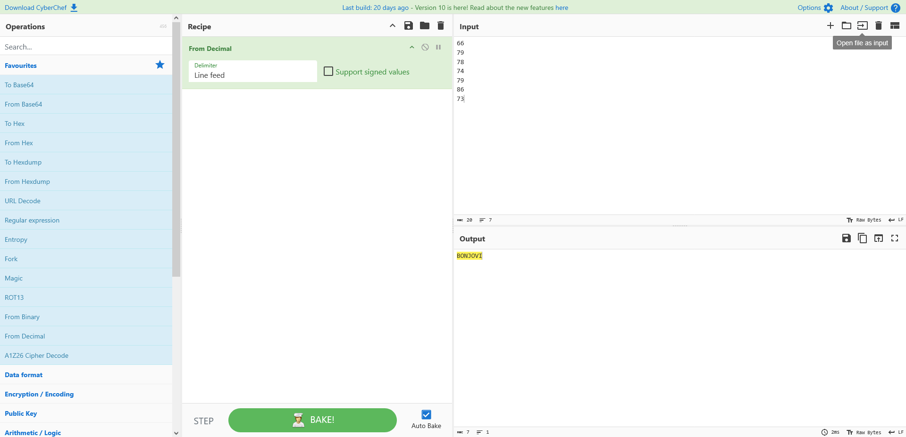

# 1_wanna_b3_a_r0ck5tar

## Description

I wrote you another song. Put the flag in the picoCTF{} flag format

### Disclaimer

The Rockstar language has changed since this problem was released! Use this Wayback Machine URL to use an older version of Rockstar, [here](https://web.archive.org/web/20190522020843/https://codewithrockstar.com/online).

## Approach

We are given the file `lyrics.txt` which is supposed to be a program written in the Rockstar language.

``` Rockstar
Rocknroll is right
Silence is wrong
A guitar is a six-string
Tommy's been down
Music is a billboard-burning razzmatazz!
Listen to the music
If the music is a guitar
Say "Keep on rocking!"
Listen to the rhythm
If the rhythm without Music is nothing
Tommy is rockin guitar
Shout Tommy!
Music is amazing sensation
Jamming is awesome presence
Scream Music!
Scream Jamming!
Tommy is playing rock
Scream Tommy!
They are dazzled audiences
Shout it!
Rock is electric heaven
Scream it!
Tommy is jukebox god
Say it!
Break it down
Shout "Bring on the rock!"
Else Whisper "That ain't it, Chief"
Break it down
```

The first thing I did was rename the file from `lyrics.txt` to `lyrics.rock` since it is a Rockstar program (This is not important or necessary)

The first thing I did was go to the Rockstar page and try running the program which gave us an input box.


Next, I'm gonna show the important part of the program with comments describing what's going on

``` Rockstar
Silence is wrong
A guitar is a six-string                        (guitar = 136)
Tommy's been down
Music is a billboard-burning razzmatazz!        (Music = 1970)
Listen to the music                             (music = STDIN)
If the music is a guitar                        (IF music = guitar)
Say "Keep on rocking!"
Listen to the rhythm                            (rhythm = STDIN)
If the rhythm without Music is nothing          (IF rhythm - Music = 0)
Tommy is rockin guitar
Shout Tommy!
```

From the comments above we should input `136` then `1970`

This outputs a bunch of numbers which we can encode into text


Then we can encode it to get the flag. I used [CyberChef](https://gchq.github.io/CyberChef/)



We can then put this in the picoCTF{} format and submit!
