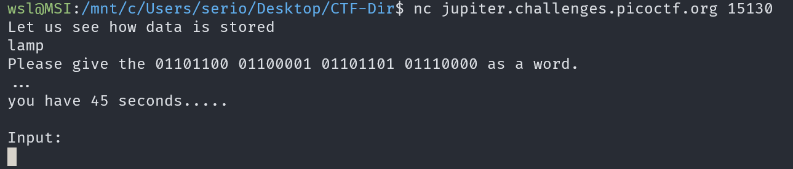
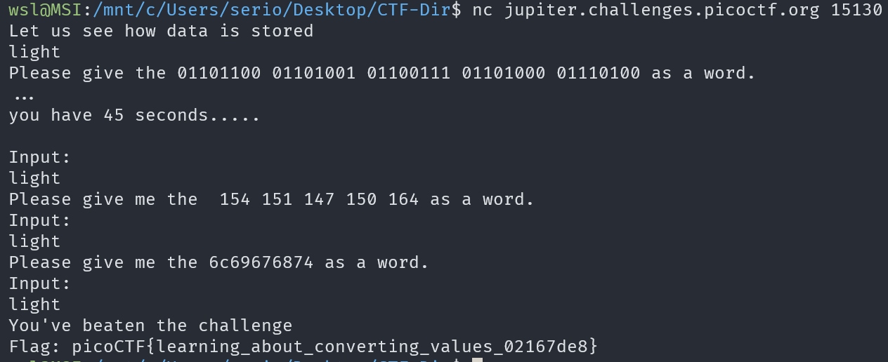

# Based

## Description

To get truly 1337, you must understand different data encodings, such as hexadecimal or binary. Can you get the flag from this program to prove you are on the way to becoming 1337?

## Approach

For this challenge we need to connect to a server and convert the given numbers to text.

I don't know if this is suppose to happen but I happened to get `light` as the answer for all 3 challenges.

For all 3 challenges I used the tool [CyberChef](https://gchq.github.io/CyberChef/) so I can work with multiple encodings without changing sites.

For the first challenge we are given binary to encode into text.

Then, for the 2nd challenge we are given octal which we need to convert.

Finally, We are given hexadecimal which we need to convert to text. Completed all of these challenges will give us the flag.
