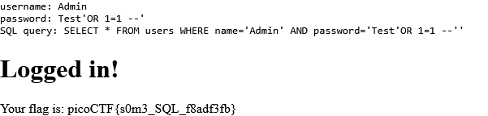

# Irish-Name-Repo 1

## Description

There is a website running at <https://jupiter.challenges.picoctf.org/problem/33850/>. Do you think you can log us in? Try to see if you can login!

## Approach

Navigating to the homepage of the challenge site shows us a bunch of peoples photo's with their names and a quote.

When we open the sidebar we see their are 2 pages: `Support` and `Admin Login`

Next I went to the Admin Login page which has a field for Username and Password. I looked over the source for the page for any client side validation but instead I found a hidden input called `debug`.

Next I tried to test the page by using the Username `Admin`, password `Test` and set the value of `debug` to 1 using the `Inspect` Tool in my browser.

This result shows us the exact SQL statement being sent with our data.

We can exploit this by adding `' OR 1=1 -- '` to the end of our password and redoing the login which should give us the flag.

