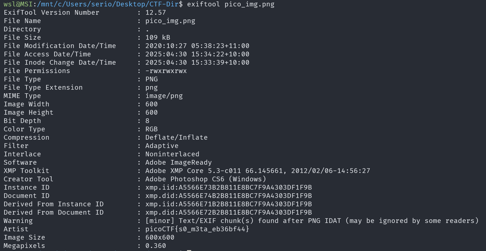

# So Meta

## Description

Find the flag in this picture.

## Approach

We are given the file `pico_image.png`.

Since the title is `So Meta` I decided to check the metadata of the picture using `exiftool` with the command `exiftool pic_img.png`.

The flag is the value of the `Author` field near the bottom of the metadata.
