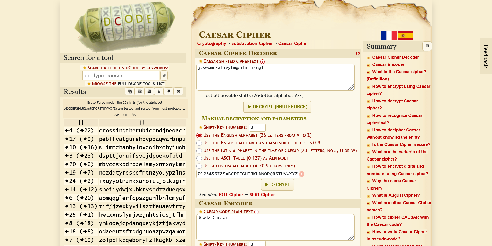

# caesar

## Description

Decrypt this message.

## Approach

We are given the following message: `picoCTF{gvswwmrkxlivyfmgsrhnrisegl}`

Since we don't know the key we can just put it through an online caesar cipher bruteforcer to try and get the original message.

The only one of the results that seems to be a valid message is the first result with a key of 4 which worked!
