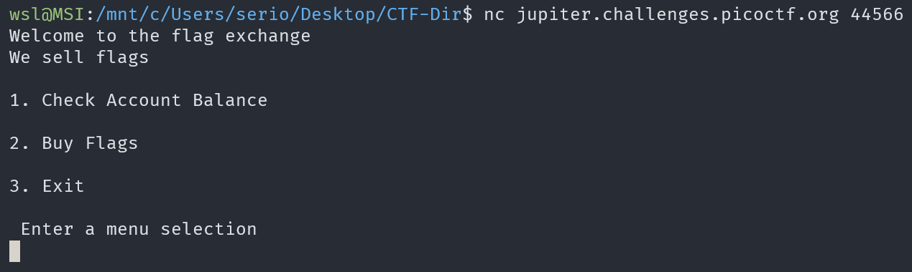
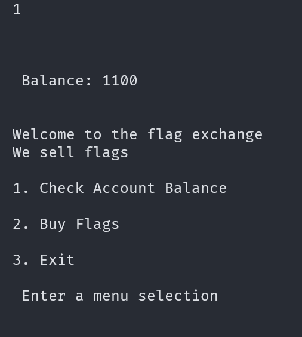
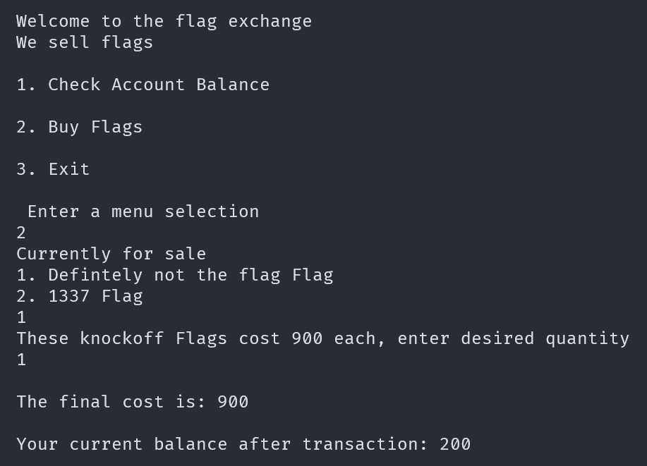
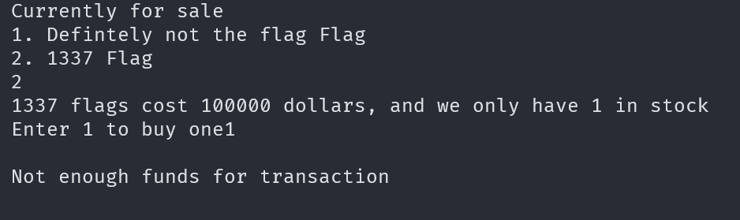
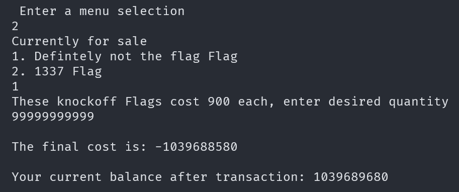
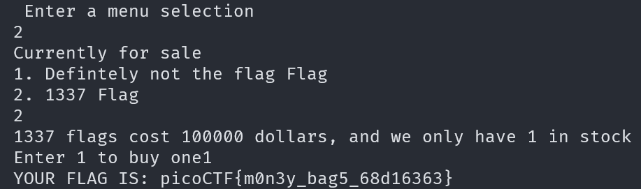

# flag_shop

## Description

There's a flag shop selling stuff, can you buy a flag?

## Approach

The first thing I tried was to access the service we are given using the command `nc jupiter.challenges.picoctf.org 44566`.



We can check our account balance which (starts at 1100) returns the balance then takes us back to the main menu



The second thing we can do is buy flags using our account balance. There are 2 choices, **Definitely not the flag** which costs 900 and there has infinite stock.



I bought 1 which reduced my balance but we didn't get the option to actually look at the flag.

The other option is to buy the **1337 flag** which costs 100000 and there is only 1 in stock.



From here we can't really get anywhere so I'm going to check the source code we are given: `store.c`.

I'm not going to describe the whole code but I'll show the important part.

``` C
if(auction_choice == 1){
                printf("These knockoff Flags cost 900 each, enter desired quantity\n");

                int number_flags = 0;
                fflush(stdin);
                scanf("%d", &number_flags);
                if(number_flags > 0) {
                    int total_cost = 0;
                    total_cost = 900*number_flags;
                    printf("\nThe final cost is: %d\n", total_cost);
                    if(total_cost <= account_balance){
                        account_balance = account_balance - total_cost;
                        printf("\nYour current balance after transaction: %d\n\n", account_balance);
                    }
                    else{
                        printf("Not enough funds to complete purchase\n");
                    }
                }
```

Basically, this is the part of the program that happens when you are buying **Definitely not the flag**. 

To exploit this code, we can enter a large enough value for `number_flags` which will make `total_cost` so big that the value wraps around to a negative value.

Since `total_cost` will be negative `total_cost <= account_balance` will evaluate to `true` and it will subtract the negative value of `total_cost` from `account_balance` which should increase the balance.

I did a test run using the input `99999999999` which gave us the following result.



It worked!!! 

Now we should be able to buy the 1337 flag which gives us the flag.

