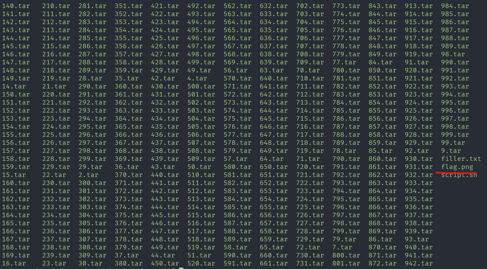

# like1000

## Description

This .tar file got tarred a lot.

## Approach

We are given a .tar archive called `1000.tar`. I tried extracting it using `tar -xf 1000.tar` which gave us `999.tar` and `filler.txt` which was nothing.


Because of the description I assumed we would need to extract this 1000 times so I wrote the following bash script to extract the tar archives 1000 times.

``` sh
for i in {1000..1}; do
    echo $i
    tar -xf "$i.tar"
done
```

After extracting the all of the tarballs we got the PNG file `flag.png` which displayed the flag.




P.S. Having that many tarballs can slow down your commands so I would run this revised script instead. This script includes the line `rm "$i.tar"` to delete the current tarball because we don't need it after we extract from it.

``` sh
for i in {1000..1}; do
    tar -xf "$i.tar"
    rm "$i.tar"
done
```
