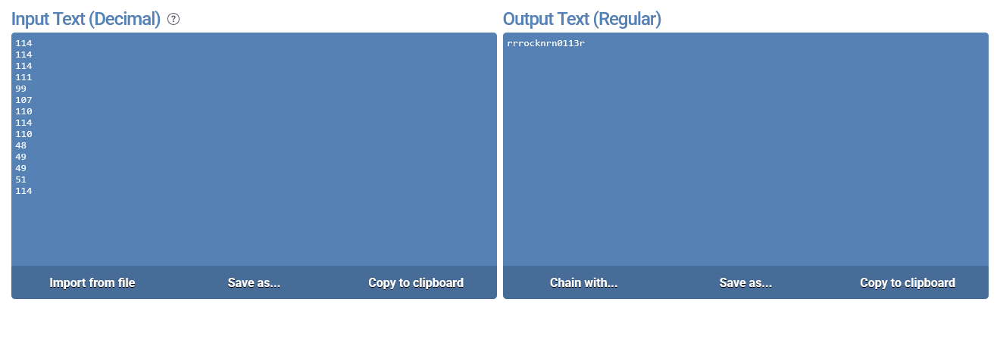

# mus1c

## Description

I wrote you a song. Put it in the picoCTF{} flag format.

## Approach

I believe this is another challenge using the Rockstar Programming Language so the first thing I did was try and run it using the [Rockstar Interpreter](https://codewithrockstar.com/online.html)

When I ran the code it gave me some numbers as output which I put into an [Online Decimal to Hex Converter](https://onlinetexttools.com/convert-decimal-to-text)

Since this looked like some flag text I decided to put it into the picoCTF{} format which was the correct flag!
