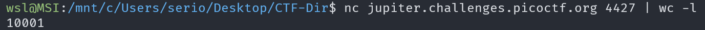
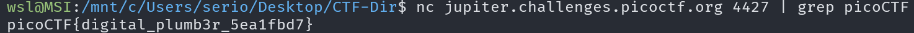

# plumbing

## Description

Sometimes you need to handle process data outside of a file. Can you find a way to keep the output from this program and search for the flag?

## Approach

First I tried connecting to the address we are given which returns 10,001 lines.

We can just pipe the response from the server into grep and search for the flag format using the command: `nc <server address> | grep picoCTF`.

This command should return the flag.

