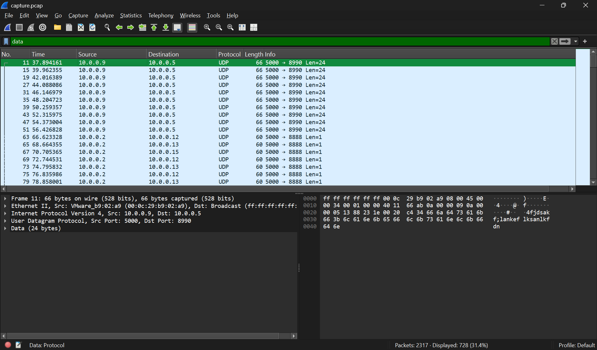

# shark on wire 1

## Description

We found this packet capture. Recover the flag.

## Approach

For this challenge we are given the packet capture: `capture.pcap`

We can open this with [Wireshark](https://www.wireshark.org/) to start looking for the flag

Once inside Wireshark I went to `Statistics -> Protocol Heirarchy` to see if there's anywhere obvious the flag would be.

The first place I wanted to look were the UDP data packets so I applied the `data` filter which returned 728 packets.

Next I went to `Analyze -> Follow -> UDP Stream` which reconstructs the captured packets data into the whole original message. This greatly reduces the number of items you need to see and makes the content of packets more readable.

I clicked through a couple streams and found the flag on stream 6

