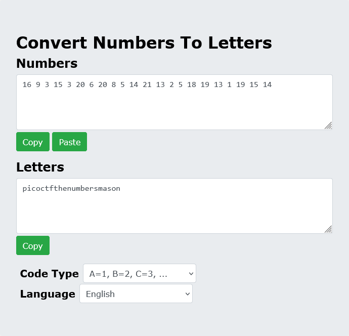

# The Numbers

## Description

The numbers... what do they mean?

## Approach

Downloading the file shows a .png image with a bunch of numbers.

The `{}` symbols in the numbers shows that this probably decodes into our flag which means the first 4 numbers translate to pico. So it's just a direct conversion from the letter to it's position in the alphabet. Using [THis Tool](https://www.boxentriq.com/code-breaking/numbers-to-letters), I converted the numbers to the flag.

