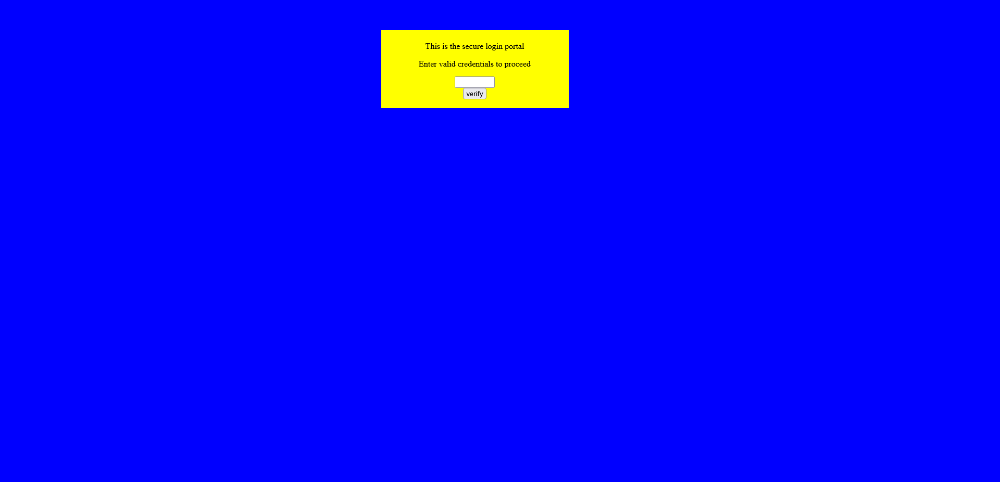

# dont-use-client-side

## Description

Can you break into this super secure portal?

## Approach

Going to the web page linked in the challenge takes us to the following page

Given the title I didn't even try the login I went straight to the page files because I assumed their would be client side validation for this page.

In the HTML for the page I found a JavaScript function called verify that checks the password on the login page for what appears to be the flag but in the wrong order.

If you examine the line: ` if (checkpass.substring(split, split*2) == 'CTF{') {` We can see that it's saying the second part (starting from 0) to the third part so we can just reorder the line to get the correct order of flag which is gives us the flag if we combine them
.