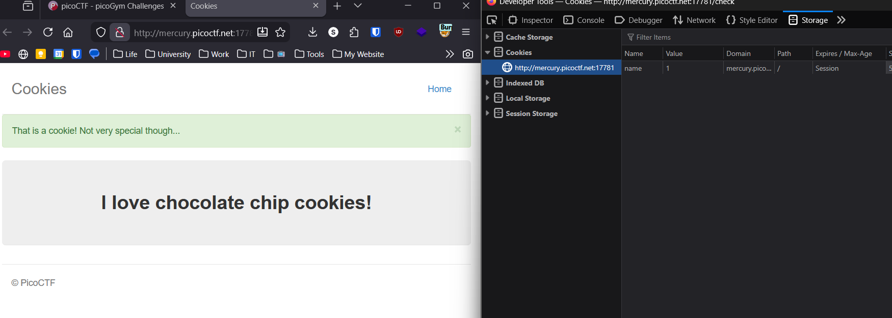
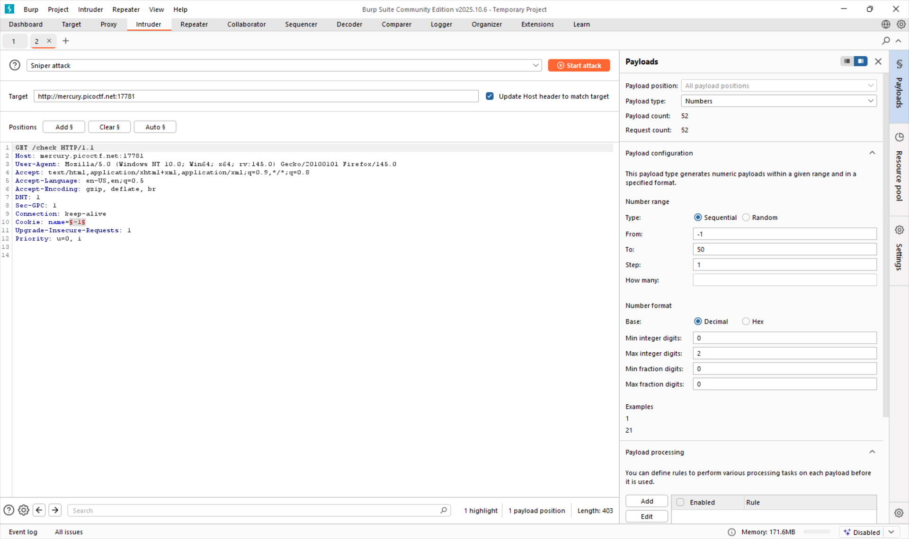
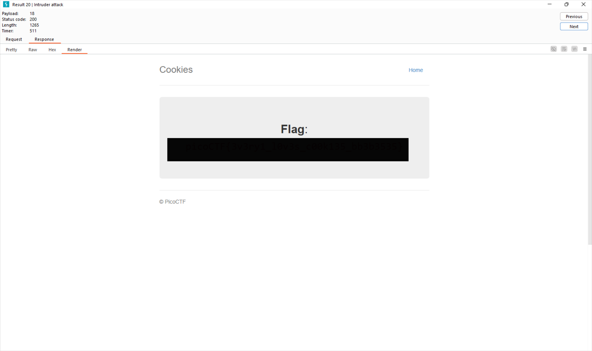

# Cookies

**Challenge Link:** <https://play.picoctf.org/practice/challenge/173>

## Description

>Who doesn't love cookies? Try to figure out the best one.

## Writeup

After going to the page I instantly went to check the cookies in DevTools and found that when you change the value it goes to a page for a different cookie.

-1 is the value for the cookie input page and then it goes up from there so I thought this would be a good place for **Burp Suite's Intruder**

After configuring I started the attack and found that the highest number was `28`. But back to the important stuff, the flag was found on the page with the cookie being `18`.

