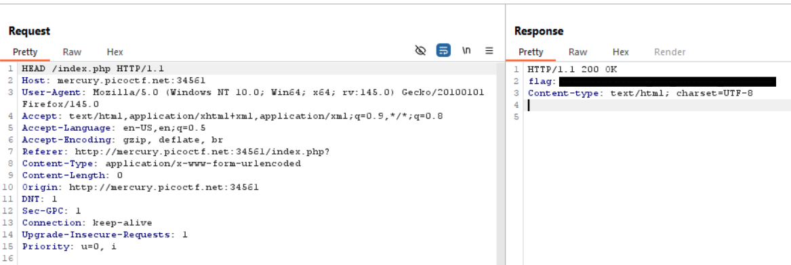

# GET aHEAD

**Challenge Link:** <https://play.picoctf.org/practice/challenge/132>

## Description

>Find the flag being held on this server to get ahead of the competition

## Writeup

### Initial Analysis

Before I touch any buttons on this page I'm going to check the page source to see if anything is there. In the below snippets we can see that when you press the red button it sends a `GET` request and when click blue you send a `POST` request.

```html
...

<form action="index.php" method="GET">
    <input type="submit" value="Choose Red"/>
</form>

...

<form action="index.php" method="POST">
    <input type="submit" value="Choose Blue"/>
</form>

...
```

### Testing a theory

Given the title of the challenge, I assumed I need to send a `HEAD` request to the `index.php` page.

To test this theory I'm going to use **Burp Suite** and modify a request to make it a `HEAD` request and see what response I get.


