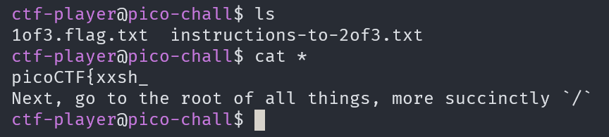
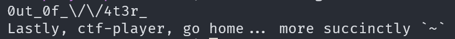
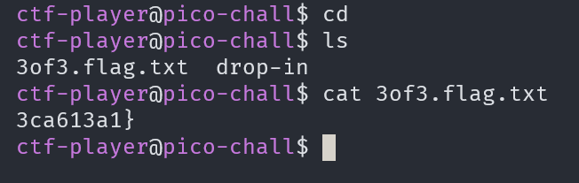

# Magikarp Ground Mission

## Description

Do you know how to move between directories and read files in the shell? Start the container, `ssh` to it, and then `ls` once connected to begin. Login via `ssh` as `ctf-player` with the password, `ee388b88`

## Approach

After `ssh`ing into the container and listing the files we see the first part of a flag and some instructions for the 2nd flag

Next we need to go to the root of the filesystem using `cd /`. Theres the next part of the flag and some more instructions

It's telling us to go to `~` which is our home directory. We can get there with `cd` by itself or `cd ~`

Now we can combine all parts to get the flag!!
