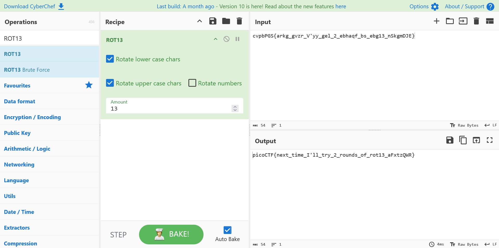

# Mod 26

## Description

Cryptography can be easy, do you know what ROT13 is?

cvpbPGS{arkg_gvzr_V'yy_gel_2_ebhaqf_bs_ebg13_nSkgmDJE}

## Approach

For this challenge I used [CyberChef](https://gchq.github.io/CyberChef/)

Using the `ROT13` recipe I just provided the ciphertext which returned the flag

