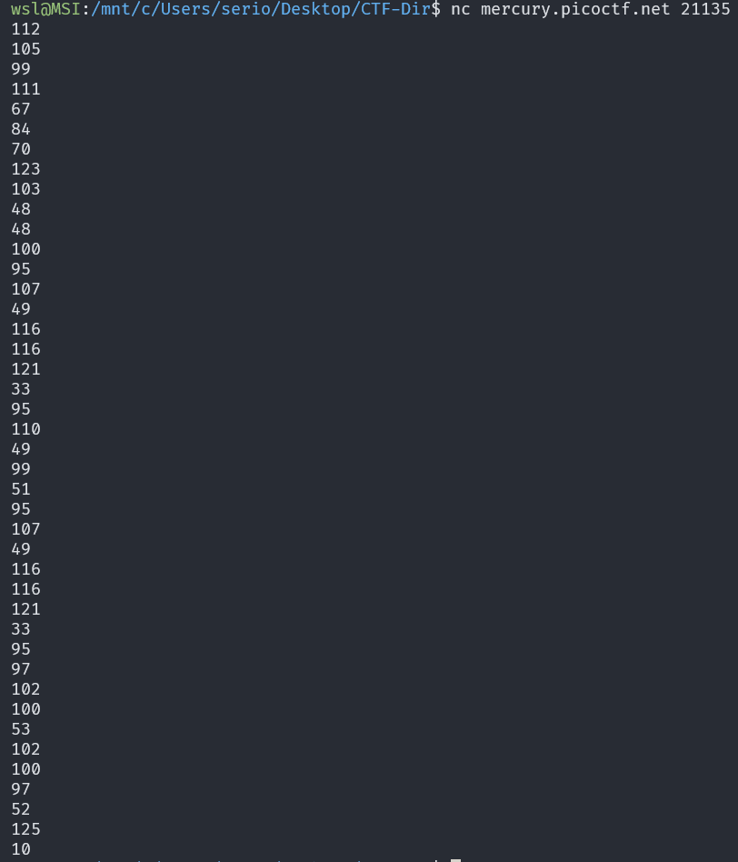
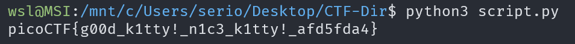

# Nice netcat...

## Description

There is a nice program that you can talk to by using this command in a shell: $ nc mercury.picoctf.net 21135, but it doesn't speak English...

### Approach

I tried connecting to the program which returned a bunch of numbers so I ran it again by redirected the output to the file `out.txt` using `nc mercury.picoctf.net 21135 > out.txt`.



We can assume that the numbers are just `ASCII`

So I wrote the following `python` script to get the flag from the numbers I saved in `out.txt`.

``` py
with open("out.txt", "r") as fr:
    nums = fr.read().strip().split("\n")

flag = ""

for num in nums:
    flag += chr(int(num.strip()))

print(flag)
```


