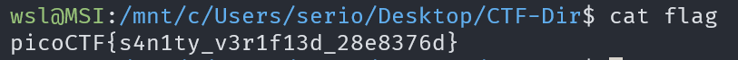

# Obedient Cat

## Description

This file has a flag in plain sight (aka "in-the-clear").

## Approach

We are given the file `flag`

To get the flag we just need to read the file. I used the command `cat flag`

