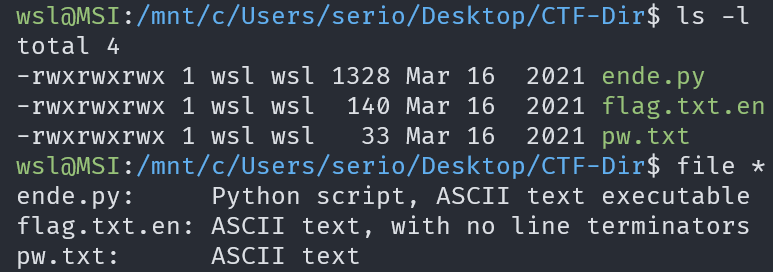
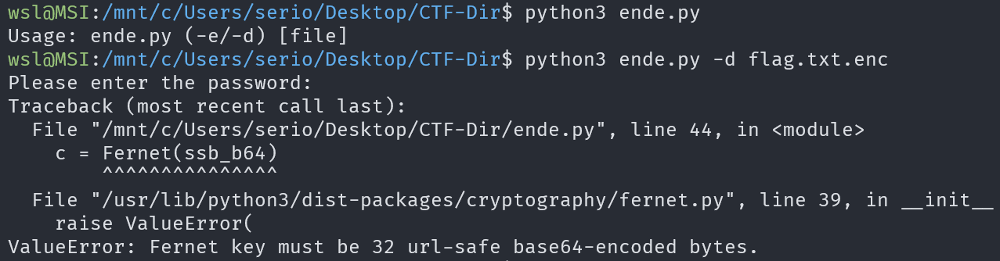
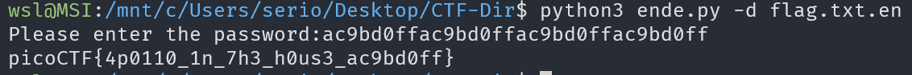

# Python Wrangling

## Description

Python scripts are invoked kind of like programs in the Terminal... Can you run this Python script using this password to get the flag?

## Approach

We are given 3 files: `pw.txt`, `ende.py` and `flag.txt.enc`

I did a test run of the program which showed we need the `-d` flag with the flag file as the argument. I also found that we need to enter a password.

Finally, running the program and entering the password gives us the flag

