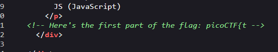
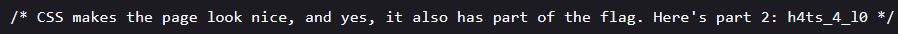
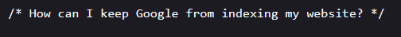
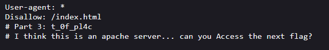
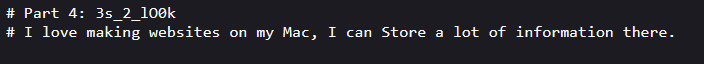
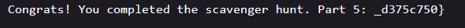

# Scavenger Hunt

**Challenge link:** <https://play.picoctf.org/practice/challenge/161>

## Description

>There is some interesting information hidden around this site `<chal_url>`. Can you find it?

## Writeup

### Flag part 1

Starting off I navigated to the homepage and it had nothing so I went to the page source and found the first part of the flag in a comment.

Next I opened the linked css and js file's `mycss.css` and `myjs.js`

### Flag part 2

In `mycss.css` I found the next part of the flag as a comment at the bottom.

### Flag part 3

In `myjs.js` I didn't find a flag part but rather another lead.

We can achieve this by using a `robots.txt`. After getting to the page I found the next part of the flag and a lead to the last part.

### Flag part 4

The lead from the previous part hinted that the next part is likely in the file `.htaccess` which I believe is used to control access to apache servers.

### Flag part 5

I actually had no idea what the previous lead was referring to until I did some research and put a bunch of filenames in the browser till I found [this one](https://en.wikipedia.org/wiki/.DS_Store).

.

Now we can combine the parts to get the flag!!!
