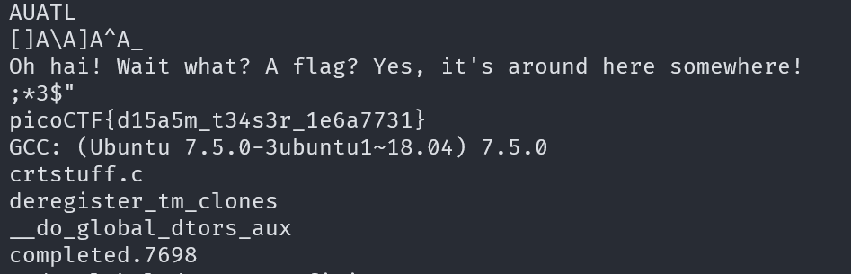

# Static ain't always noise

## Description

Can you look at the data in this binary: static? This BASH script might help!

## Approach

The bash script just uses `objdump` to disassemble the binary file and `strings` to get the strings from the file.

I'm going to start using `strings static` to get the strings out of the file

We can see the flag is right there as a string in the executable.
