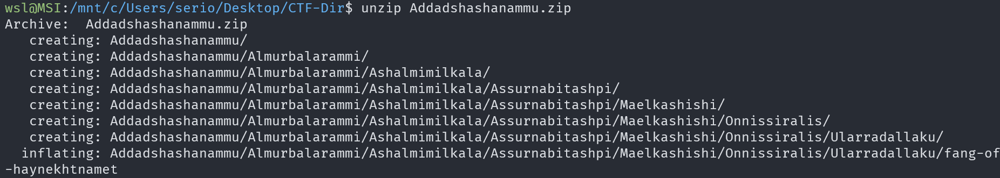
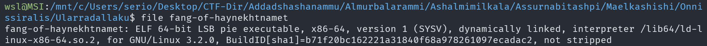
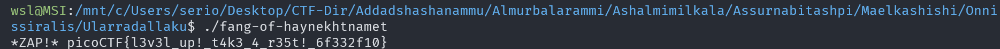

# Tab, Tab, Attack

## Description

Using tabcomplete in the Terminal will add years to your life, esp. when dealing with long rambling directory structures and filenames: `Addadshashanammu.zip`

## Approach

After downloading the zip archive I unzipped it using `unzip Addadshashanammu.zip`

We can see at the end of the output that 1 file is decompressed, `fang-of-haynekhtnamet`

I just `cd` into the directory that file is and found it was an executable

Running the program gives us the flag

