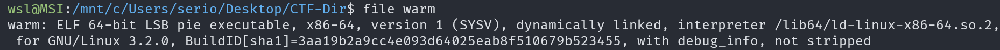
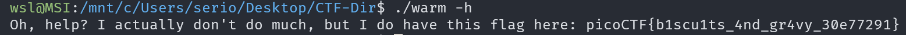

# Wave a flag

## Description

Can you invoke help flags for a tool or binary? This program has extraordinarily helpful information...

## Approach

We are given the file `warm` which is just an executable

Given the description, I tried running `./warm -h` to see help info for the program which gave us the flag.

