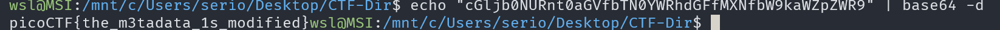

# information

## Description

Files can always be changed in a secret way. Can you find the flag?

## Approach

We are given the file `cat.jpg`

As usual I first looked at the image which didn't show anything than I looked at the metadata with `exiftool cat.jpg`

```plain
ExifTool Version Number         : 12.57
File Name                       : cat.jpg
Directory                       : .
File Size                       : 878 kB
File Modification Date/Time     : 2021:03:16 05:24:46+11:00
File Access Date/Time           : 2025:05:16 21:25:23+10:00
File Inode Change Date/Time     : 2025:05:16 21:25:22+10:00
File Permissions                : -rwxrwxrwx
File Type                       : JPEG
File Type Extension             : jpg
MIME Type                       : image/jpeg
JFIF Version                    : 1.02
Resolution Unit                 : None
X Resolution                    : 1
Y Resolution                    : 1
Current IPTC Digest             : 7a78f3d9cfb1ce42ab5a3aa30573d617
Copyright Notice                : PicoCTF
Application Record Version      : 4
XMP Toolkit                     : Image::ExifTool 10.80
License                         : cGljb0NURnt0aGVfbTN0YWRhdGFfMXNfbW9kaWZpZWR9
Rights                          : PicoCTF
Image Width                     : 2560
Image Height                    : 1598
Encoding Process                : Baseline DCT, Huffman coding
Bits Per Sample                 : 8
Color Components                : 3
Y Cb Cr Sub Sampling            : YCbCr4:2:0 (2 2)
Image Size                      : 2560x1598
Megapixels                      : 4.1
```

The **License** field looks like `base64` so I ran `echo "cGljb0NURnt0aGVfbTN0YWRhdGFfMXNfbW9kaWZpZWR9" | base64 -d` to decode the text and it decoded to the flag.


