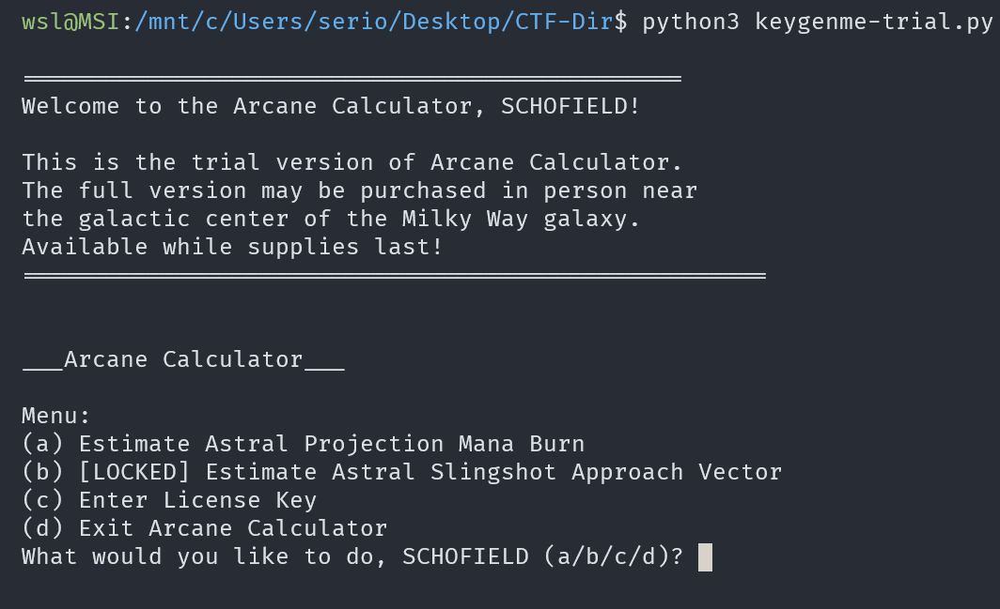

# keygenme-py

## Description

keygenme-trial.py

## Approach

For this challenge we are given the Python Program `keygenme-trial.py` which is a trial of the "Arcane Calculator".


I think the main goal of this challenge is to get the full version of the program.
It has 3 main functionalities, we are interested in the **Enter License Key** part of the program.



I can trace the function for this option in the source code to `enter_license()`

``` Python
def enter_license():
    user_key = input("\nEnter your license key: ")
    user_key = user_key.strip()

    global bUsername_trial

    if check_key(user_key, bUsername_trial):
        decrypt_full_version(user_key)
    else:
        print("\nKey is NOT VALID. Check your data entry.\n\n")
```

I need to enter the correct key that makes `check_key()` evaluate to `True` and work with the algorithm in `decrypt_full_version()`

I also know that `bUsername_trial` is defined at the start of the program.


In the `check_key()` function they check the key against a string which is `bUsername_trial` with some functions applied to it.


I added a print function the check what the value was and got `66b8e54339dc8b7ff42eb6ea4d95561c67ad1192de710700b57c98e47c8af4b5`

If we take the characters that were compared we get `e584b363`

We can also see that the it checks the start of the key against `picoCTF{1n_7h3_|<3y_of_` so the key should be `picoCTF{1n_7h3_|<3y_of_e584b363`

Since this very much looks like a flag I added `}` to the end and submitted it and it was the flag. It also decrypts the full version so you can try it.
