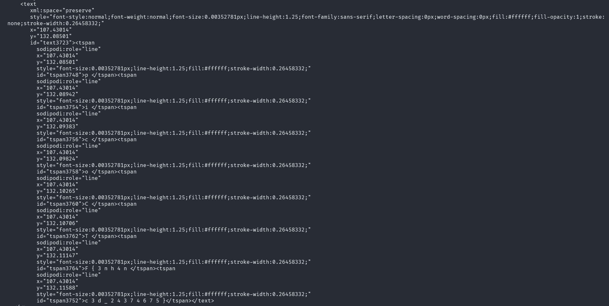

# Enhance!

## Description

Download this image file and find the flag.

## Approach

We are given a `.svg` image file which is an image which can be described using HTML or XML or something along those lines.

This means the source code of the page is legible unlike normal images

We can see near the bottom of the image there is a `<text>` element with the flag split between `` tags

A simple way I think of getting the flag out is just copying the last two lines that contain `{` and `}` just putting them in the flag format

`picoCTF{3nh4nc3d_24374675}`
