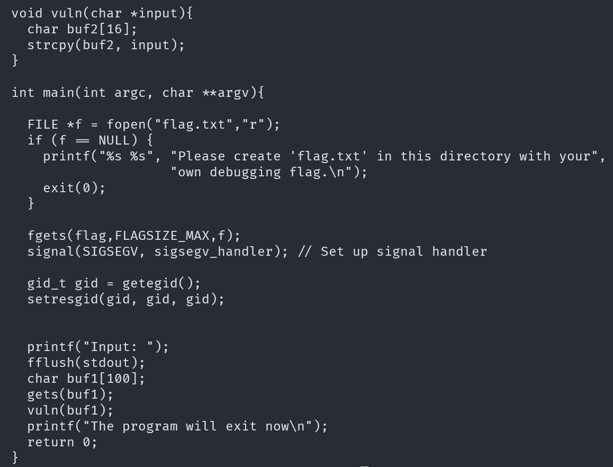
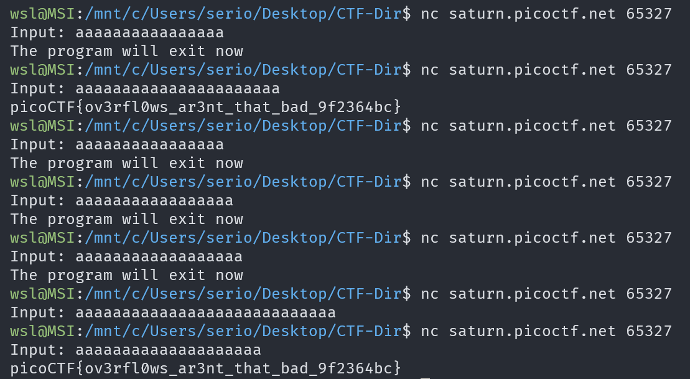

# buffer overflow 0

## Description

Let's start off simple, can you overflow the correct buffer? The program is available here. You can view source here.

## Approach

In the source code `vuln.c` we can see there is a vulnerable function that `vuln()` that performs `strcpy` from a string with **100** char limit into one with **16**.

I started by inputting the letter `a` various times until the I landed in the flag string. In the ended I landed on `aaaaaaaaaaaaaaaaaaaa` which gave me the flag.

