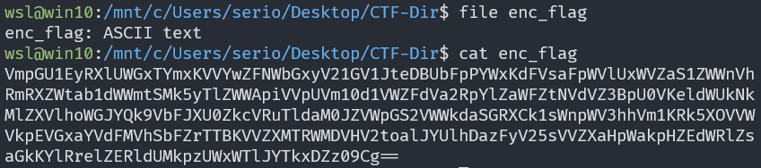

# repetitions

## Description

Can you make sense of this file?

## Approach

We are given the file `enc_flag`



Since the end of the text has the equal signs I decided to try running `base64 -d enc_flag` to see what is decodes to.


We can see that it's just more base64 so given the title I'm assuming this is just a bunch of base64 until we get the flag

I wrote the following `python` script to get the flag

``` Python
import base64

with open("enc_flag", "r") as fr:
        text = fr.read()

while True:
        if "pico" in text:
                break

        text = base64.b64decode(text).decode()

print(text)
```


