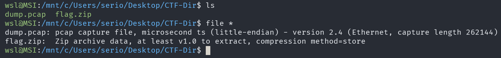
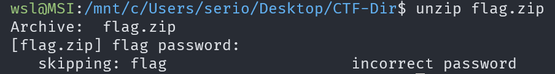
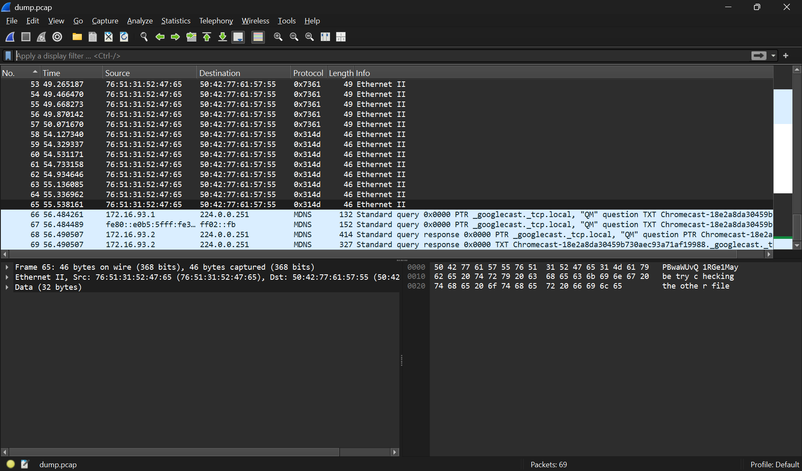
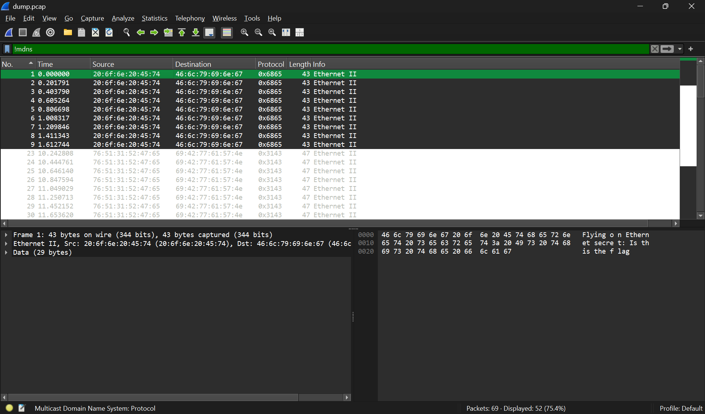
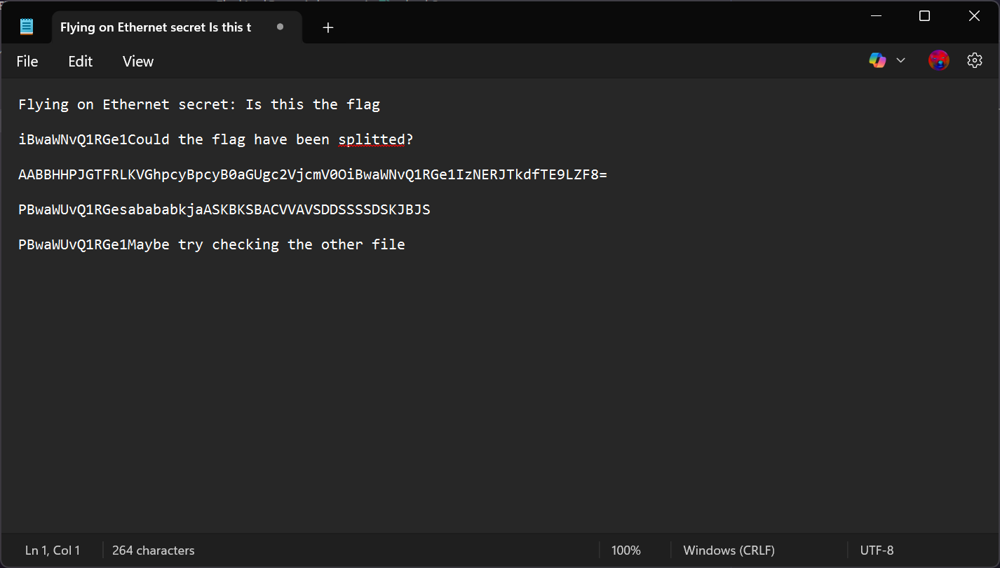
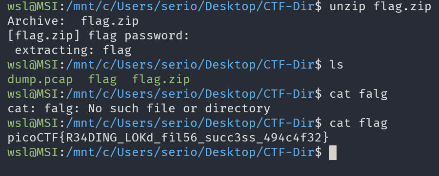

# FindAndOpen

## Description

Someone might have hidden the password in the trace file.

Find the key to unlock this file. This tracefile might be good to analyze.

## Approach

We were given a packet capture and a zip file

I tried to unzip `flag.zip` which needed a password

Then I looked at `dump.pcap` which had a bunch of **Ethernet** and **MDNS** Packets

Exclusing those led us to just the Ethernet Packets which seem to contain some text

I took out each line of unique text and put it in notepad since there weren't that many which showed some base64 encoded text

Just note that their is some of the text are just bytes from the packet not the actual data.

I decoded the longest line with the `=` at the end which gave the first part of tha flag.

I tried that as the password for the zip files since nothing else password looking came up which gave the flag

