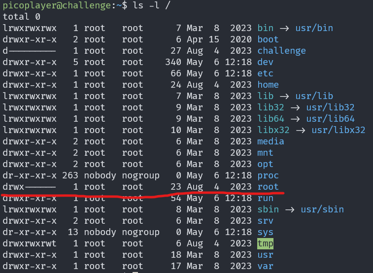
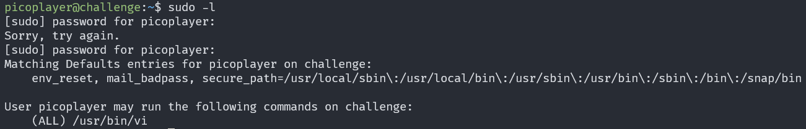
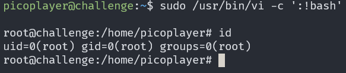
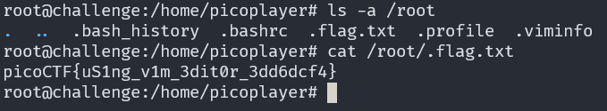

# Permissions

## Description

Can you read files in the root file? The system admin has provisioned an account for you on the main server

## Approach

For this challenge we need to connect to server using ssh

I started by checking permissions on the `/root` directory using `ls -l /` which showed we didn't have permissions to read in the directory

Next I tried to escalate my privilages so I started by running `sudo -l` which showed we are allowed to run `sudo vi`

We can run `sudo vi -c ':!bash'` to get a root shell

Now we can check the contents of `/root` where we find `/root/.flag.txt` which contained the flag

