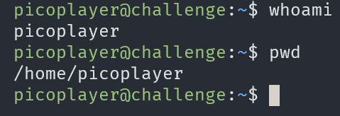
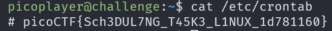

# chrono

## Description

How to automate tasks to run at intervals on linux servers?

## Approach

Before I connect to the server, the way to automate tasks on linux servers is using `crontabs` from my knowledge so that's the angle I'm taking in this challenge

First I'm going to connect to the server.

Now that I'm on the server I'm going to check the contents of `/etc/crontab` since that's where system cronjobs go on linux.

And the flag was right there!!
