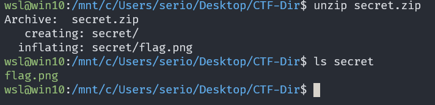

# hideme

## Description

Every file gets a flag. The SOC analyst saw one image been sent back and forth between two people. They decided to investigate and found out that there was more than what meets the eye here.

## Approach

We are given the file `flag.png` which wasn't the flag

I first checked the metadata using `exiftool flag.png` which detected some data after the ending section of the png file

Because of this I ran `binwalk flag.png` to see if it would pickup any signatures. This revealed a secret zip file called `secret`

We can see that the zip archive has one file called `flag.png` and where it starts in the file so we can carve it out. I used the command `dd if=flag.png of=secret.zip bs=1 skip=39739` which gave me the zip archive

Now we can just unzip it to get the file inside.

If we view this image we can see the flag

